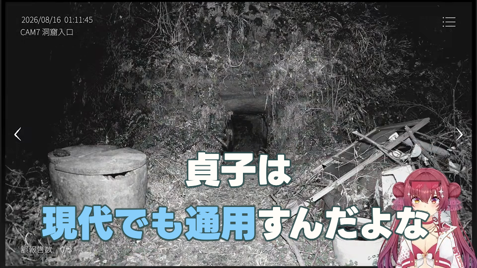
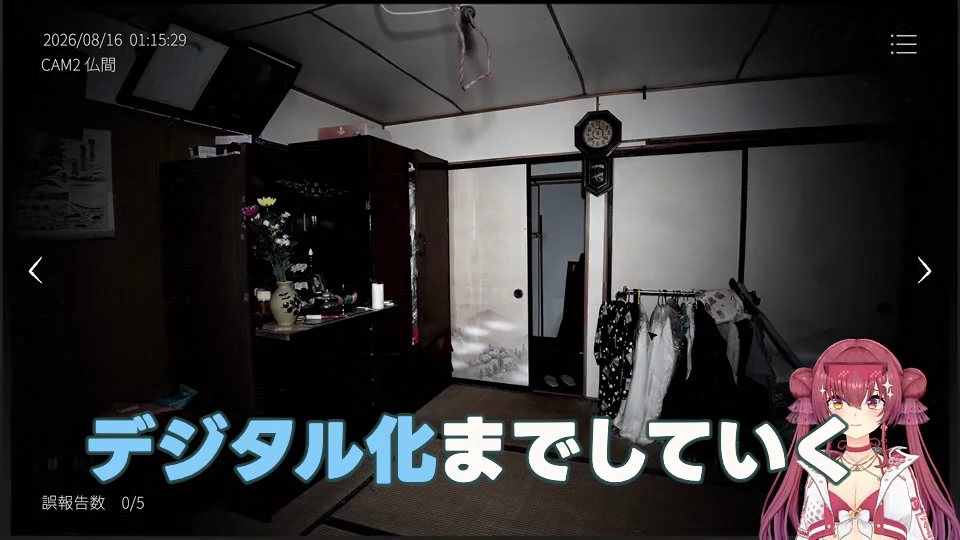
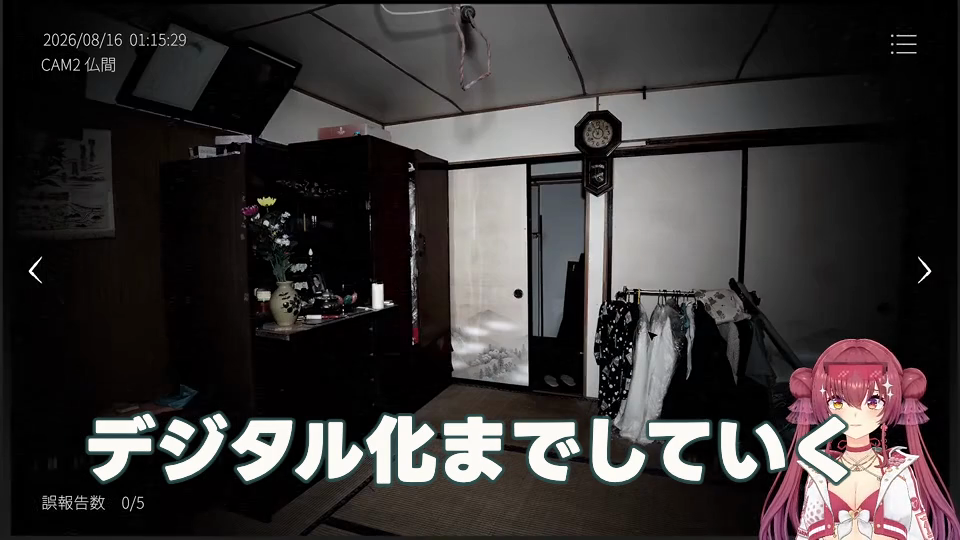

# 13.4〜13.5 字幕色改善・後修正接続

担当：Codex2。2026-09-29。**技術candidate検証完了。Yellow＋LightSkyBlueの2色で固定。人間品質・正式採用は最終統合確認へ保留し、production defaultは変更していない。**

## 決定と承認

相談役「ZEV Build Loop」の個別指示と、2026-09-29の明示的な残工程承認に従った。最新指示は、LightCoralが実背景検査で技術的に成立しない場合、4色目を探さずYellow＋LightSkyBlueへ戻すことを許可している。

既存18箇所の中央frameを1点ずつ比較し、字幕の非透明画素下の復号Yの算術平均が最大だった000194／frame16833（561.1秒、平均139.0221）を明側代表にした。全素材で最も明るいframeという主張ではない。

この字幕ではLightCoralの完成overlayのalphaが3画素で1ずつ変化した。座標とYellow→LightCoral値は (225,444):249→248、(205,449):251→250、(349,464):247→246。既存のalpha完全保持条件に不合格のため、**LightCoralをcandidateの許可値から除外**した。失敗証拠は `bright-background-v001/failure.json` と生成済み画像をそのまま保持した。閾値緩和、描画変更、第4色探索はしていない。

Yellow `#FFD65A` とLightSkyBlue `#87CEFA` は、同じ保存画像を独立した描画観測と照合して、全alpha・強調範囲外RGBA・縁／glow・透明背景の差0、字形・改行不変、safe area内を確認した。新しい背景抽出はせず、選定済み1点だけ補足した。



## 固定入力と保存配色

- 元入力：`runtime/artifacts/digest-structure-20260929-v001/drawing-evidence.json`
- 新規出力：`runtime/artifacts/caption-palette-20260929-v001/`
- 着手HEAD：`b791bb8286bebb93876c371df72f99262c0d73d1`
- 7B：導入＋本編3件＋締め、商品紹介／スパチャ除外、265字幕、17,613frame。
- 強調は既存18件のみ、全件部分Color。子表示全体と一致する場合も元の部分Colorの意味を保持。導入・締めの15字幕はNormalのまま。
- 本文・改行・範囲・時計・元素材対応・構成・音声・Panel／Scale／Bounce／Shake／Pulse・144px論理文字・DarkSlateGray縁を保持。
- 原案の本文や強調理由を再判断せず、配色だけを文脈から開発側で固定した。AI・APIの呼出しは0。

水色は次の3件、残る15件はYellow。本文・時計・色以外の計画差0、変更のない字幕は262件、新規強調0・削除0。

| 字幕ID末尾 | 保存済み強調語句 | 7B時計（frame / 30fps） | 理由 |
|---|---|---|---|
| 000171 | ソロプレイ | 14231–14370 | 先行するチームプレイ（Yellow）と対になる語句をこの会話内で区別 |
| 000194 | 現代でも通用 | 16768–16899 | 後続のデジタル化と同じ時代対応の説明 |
| 000197-readability-02 | デジタル化 | 17124–17245 | 同じ説明の配色を維持 |

保存：`palette-state.json`、`drawing-evidence.json`。有限ID・版・元7B参照・範囲・配色理由を固定し、描画／Reset時に再判断しない。自由RGB、感情分類、配色ノルマはない。

## 既存経路への接続

旧7A／7Bは実装SHAに束縛されているため旧実装・旧trust／registryを編集せず、candidate用の保存・再読入口から既存の範囲解決、540p字幕描画、合成、媒体検証へ接続した。旧Colorはpalette field自体がない場合だけ従来Yellowを解決する。明示null／undefined、未知ID（LightCoralを含む）、自由RGB、不正な範囲は拒否する。

将来の同一判断用入口では、既存の一回の判断応答のColorだけに有限IDを加える。原応答bytesと既存validator用の正規化応答を区別して保存・束縛する。新しいAI呼出し段数やproviderは追加しておらず、productionの判断入口も切り替えていない。今回の配色は保存済み判断から派生した開発側candidateであり、新しいAIによる無修正の自動判断実績ではない。

### 一件変更・解除・Reset

対象は000197-readability-02「デジタル化」。保存自動案のLightSkyBlueからYellowへ一件変更→新しい保存先へ保存→再読→描画→Normalへ解除→保存・再読・描画→Resetでoverrideを削除→保存済みLightSkyBlueへ戻す、まで実行した。

- 対象外字幕・構成・時計・保存自動案は不変。
- Normalは元の通常表示計画に一致。
- Resetは解決済み計画・演出指定・候補保存hashに完全復帰。
- **Reset後のMP4は元candidateのMP4と全byte一致**：1,024,308 bytes、SHA256 `f37beb8049b5c3c5f30b2c60cf32abeaa854c29e5288866dc294bf0a4580be63`。
- 一件操作の4本は181frame、6.033333秒、音声packet・復号音声・サンプル数・全frame時計が一致。対象外3字幕のPNG／描画設定は各操作で一致。
- 対象字幕のYellow／水色／Normal／Resetの完成alpha差0。Yellowと水色の完全不透明な指定色画素は各9,841。操作が実映像へ出たことを完成MP4のframe75でも確認した。




## 局所動画と独立再読

動画本体はGitへ追加しない。以下は出力rootからの相対path。各fileは `clips/<名称>/development-palette-proxy.mp4`。

| 名称 | 元7B frame区間（末尾を含まない） | 尺 | 描画工程の実測 | 別process再読 |
|---|---|---|---|---|
| yellow | 2138–2328 | 6.333秒 | 17.602秒 | 10.898秒・合格 |
| cyan | 17094–17275 | 6.033秒 | 22.883秒 | 11.121秒・合格 |
| override | 同上 | 6.033秒 | 22.578秒 | 11.233秒・合格 |
| normal | 同上 | 6.033秒 | 22.581秒 | 11.228秒・合格 |
| reset | 同上 | 6.033秒 | 22.153秒 | 11.223秒・合格 |

2色fallbackにより、LightCoralの代表動画は生成していない。すべて960×540／30fpsの局所技術見本で、長尺A/B/C・1080p全編・人間確認依頼は行っていない。

5本とも別processの正規readerから、入力・実装・tool・描画状態・PNG・音声・媒体・全frame時計を独立照合した。7Bの背景は保存済みreceiptと媒体byteの束縛を再利用し、旧全編QCを再実行したとは扱わない。旧7A／7B動画と実装参照83件も最終時点で照合し、不変を確認。

## 試験・証拠・履歴

- 現在の2色candidate：**35試験合格、失敗0、skip0**。policy10、view4、同一判断9、renderer8、画素判定4。結果：[two-color-tests.tap](two-color-tests.tap)。拒否・改ざん・欠損・版不一致・一件変更・Normal／Reset・他演出保持・540p限定を含む。
- 当初の3字幕×3色の画素試験は保存済み結果を再利用。一行中央部分000028、二行000045、子表示全体と一致する部分Color000148-readability-02。全9描画で全alpha・範囲外・縁／glow差0、旧Yellowは保存7BのPNG／RGBAと一致。後の明側1点でLightCoralが不合格になったため、この旧9件だけで全3色合格とはしていない。
- 初回probeは保存状態名の誤照合で描画前に失敗。2回目は縁を隠した補助的な塗り単独のalphaに差があり、完成overlayの保証と補助観測を分離して記録。完成alphaの基準は維持しており、今回の明側3画素差を不合格にした。
- 途中の自動承認審査は旧停止指示を理由に2回拒否。迂回せず報告し、最新の明示承認後に再開。現在の未解決障害ではない。
- [verification.json](verification.json) に保存配色、明側の不合格・2色合格、独立再読、媒体SHA、実測、旧入力保持の参照を集約。以前のTAPは履歴として保持し、重複を合計しない。
- 正常実走後に追加描画や無関係な高速化を始めていない。Node親メモリのみ記録、子toolを含む同時ピークは未計測。並行実行した工程の時間は足して総wall timeにしない。

## 再現手順

新しい未使用出力先で実行する。既存結果は上書き不可。今回の具体的出力先はrun scriptへ固定されており、以下を既存directoryへ再実行すると拒否する。

```sh
node --test tools/digest-quality/caption-palette-policy.test.mjs tools/digest-quality/caption-palette-view.test.mjs tools/digest-quality/caption-palette-pixel-probe.test.mjs evals/clip_composition/presentation_auto_effects_palette_v001.test.mjs evals/clip_composition/presentation_dev_proxy_palette_render_v001.test.mjs
node tools/digest-quality/caption-palette-bright-background.mjs
# 今回はLightCoralの完成alpha不一致で停止。生成済み2色を独立再検証：
node tools/digest-quality/caption-palette-bright-fallback.mjs
node tools/digest-quality/caption-palette-run.mjs prepare runtime/artifacts/caption-palette-20260929-v001/pixel-probe-v003/summary.json runtime/artifacts/caption-palette-20260929-v001/bright-fallback-v001/summary.json
node tools/digest-quality/caption-palette-run.mjs edit-proof
# NAME = yellow / cyan / override / normal / reset、それぞれ1回
node tools/digest-quality/caption-palette-run.mjs render NAME
node tools/digest-quality/caption-palette-run.mjs reread NAME
node tools/digest-quality/caption-palette-final-check.mjs
```

任意の既存Color一件を保存し直す入口は `caption-palette-run.mjs edit <evidence.json> <caption-id> <yellow|light-sky-blue|Normal|Reset> <新規directory>`。今回の保存済み動画reader自体は `readPresentationDevProxyPaletteV001` を別processから呼べる。

## 完了条件の確認

1. 明側1点の有限色検査：実施。LightCoral不合格を保存し、許可された2色へ限定。
2. 有限candidate固定：Yellow／LightSkyBlue。新色探索なし、人間品質採用なし。
3. 保存配色：既存18範囲、色変更3件。新対象・時計・構成変更なし。
4. 一件変更／Normal解除／Reset：保存・再読・実描画・元水色へのbyte完全復帰済み。
5. 短い代表媒体：許可された2色＋一件操作の局所5本。長尺生成なし。
6. 独立再読：5本合格。
7. 対象試験：35件合格、旧成果参照83件不変。
8. 記録：本reportと軽量証拠へ集約。動画・診断中間物は既存ignored成果物領域。
9–11. 今回の新規実装・試験・reportのみmainへcommit／通常pushし、最終Git状態を直接報告で示す。旧tracked file・ignore設定の変更なし。
12. 指示元の相談役会話へ技術完了報告と `NEXT_REQUEST｜13.4〜13.5技術完了` を直接送信する。

未確認：人間品質・正式採用、将来の実AI配色判断、最終1080p統合QC。これらは今回の限定技術完了と区別し、最終人間確認へ集約する。
