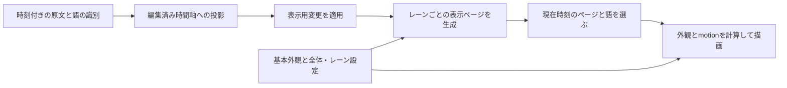
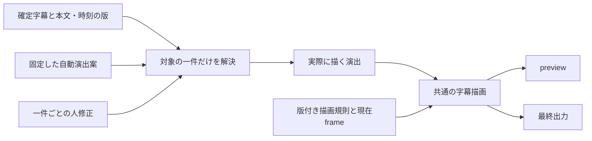

# OpenChatCut研究 — Checkpoint 2：字幕・motion・保存・描画の境界

確認日：2026-09-16（日本時間）

対象：[OpenChatCut `8411023f8411f3c16538c3dab8fee4b7f9e97661`](https://github.com/0xsline/OpenChatCut/tree/8411023f8411f3c16538c3dab8fee4b7f9e97661)

方法：指定commitの公開sourceの静的読取のみ。**未導入・未起動・未実行。Checkpoint 2で停止する。**

## 1. 結論

ZEVの最小構成として必要なのは、**確定字幕への参照、固定した自動演出案、一件ごとの人修正、版を固定した描画規則**を分けて保存することだと考える。実際に描く演出は、自動案と人修正を合成して導出できる。「自動案へ戻す」は、その一件の人修正だけを除去する操作になる。

これは今回のsourceから抽出した**ZEV向けの推論・設計候補**であり、OpenChatCutがその構造を備えているという報告ではない。schema・契約・ZEV実装は作成していない。

sourceで確認できた重要な差は次の四点。

1. **字幕本文と外観は分離されているが、個別の部分演出を保存する粒度は不足する。** 字幕一件を選んで外観を変更しても、通常字幕ではトラック全体、手動字幕ではレーン全体へ変更が及ぶ。
2. **字幕motionは時刻から決定的に計算される。** ただし字幕全体の単一選択で、確定字幕一件ごとのmotion指定ではない。また、発話の強調色と脈動では「活動中」の時間定義が異なる。
3. **提案、Undo、保存版はあるが、一件を固定自動案へ戻す仕組みとは異なる。** 採用後の編集は現在のprojectへ書き込まれ、通常Undoや保存版の復元はproject全体を対象にする。
4. **字幕の本描画はpreviewと出力で共通だが、画面全体の完全一致は保証できない。** 代理映像、非選択の画面切替の近似表示、字幕編集用の重ね表示には別経路がある。

以下では **【事実】＝読んだsourceの処理、【推論】＝ZEVへの適用候補、【未確認】＝実機・実出力が必要な事項**を分ける。OpenChatCut全機能の網羅的な不存在証明は行っていない。

## 2. 字幕の保存単位と表示単位

### 2.1 本文から画面まで

【事実】字幕は、元の時刻付き語、素材上の位置から編集済み時間軸への投影、表示用上書き、表示ページの生成、描画という順に処理される。表示ページと編集行は派生物であり、すべてが独立した固定字幕レコードとして保存される構造ではない。

| 単位 | sourceでの意味 | ZEVとの違い・限界 |
| --- | --- | --- |
| word：時刻付き語 | 本文、開始・終了ミリ秒、任意の話者、書き起こし世代内の識別子を持つ | 常に日本語の一単語・一文字であるとは限らない。文字内の範囲・文字ごとの時刻は持たない |
| 入力元・レーン | 字幕の入力元と、その表示・配置・外観のまとまり | 演出一件の保存単位ではない |
| page：表示ページ | 語列をまとめ、表示する語と開始・終了を持つ。自動字幕では派生計算する | 外観設定の語数上限等でまとめ方が変わり得る。ZEVの確定表示字幕と同一視しない |
| cue：編集行 | 自動字幕は表示ページから編集用の行を作る。手動字幕は一つの時刻付き本文レコードを一文として扱う | cueという名前だけで本文・時刻・IDの不変性は決まらない |
| span：描画片 | 描画時に語を包むHTML要素 | 任意文字範囲の装飾を永続保存するrich textの範囲指定ではない |

根拠：[時刻付き語](https://github.com/0xsline/OpenChatCut/blob/8411023f8411f3c16538c3dab8fee4b7f9e97661/src/transcript/types.ts#L3)、[字幕とレーンの型](https://github.com/0xsline/OpenChatCut/blob/8411023f8411f3c16538c3dab8fee4b7f9e97661/src/captions/types.ts#L119)、[ページ生成](https://github.com/0xsline/OpenChatCut/blob/8411023f8411f3c16538c3dab8fee4b7f9e97661/src/captions/captionPages.ts#L46)、[編集行生成](https://github.com/0xsline/OpenChatCut/blob/8411023f8411f3c16538c3dab8fee4b7f9e97661/src/captions/captionCues.ts#L27)、[語の描画片](https://github.com/0xsline/OpenChatCut/blob/8411023f8411f3c16538c3dab8fee4b7f9e97661/src/captions/CaptionsLayer.tsx#L113)。

### 2.2 本文・全体外観・部分外観

【事実】原文を参照し、表示用の本文差し替え・非表示・改ページ・表示時刻の移動を別に保持する。外観は基本プリセットに字幕トラック全体の上書きを重ね、複数レーンではさらにレーンの上書きを重ねる。色等の外観だけを更新する経路は、元の語の本文・時刻・識別子を変更しない。[表示用変更](https://github.com/0xsline/OpenChatCut/blob/8411023f8411f3c16538c3dab8fee4b7f9e97661/src/captions/resolve.ts#L125)、[基本外観への合成](https://github.com/0xsline/OpenChatCut/blob/8411023f8411f3c16538c3dab8fee4b7f9e97661/src/captions/renderStyles.ts#L5)、[レーン外観への合成](https://github.com/0xsline/OpenChatCut/blob/8411023f8411f3c16538c3dab8fee4b7f9e97661/src/captions/CaptionsLayer.tsx#L204)。

ただし、語ごとの表示用変更に色・書体・拡大率・文字範囲はない。通常字幕一件を選んだ外観・位置変更はトラック全体の設定へ、手動字幕一件からの変更は所属レーン全体へ書き込む。**選択対象の粒度と、変更が及ぶ粒度が違う。** [上書き可能な内容](https://github.com/0xsline/OpenChatCut/blob/8411023f8411f3c16538c3dab8fee4b7f9e97661/src/captions/types.ts#L83)、[選択後の更新範囲](https://github.com/0xsline/OpenChatCut/blob/8411023f8411f3c16538c3dab8fee4b7f9e97661/src/captions/captionPreviewTarget.ts#L128)。

【推論】本文と外観の分離は借りられる。一方、ZEVで一件を直すために全体の外観設定を更新する方法は適さない。また、外観変更から字幕を再びページ分けする方式を持ち込むと、確定字幕を不変にする今回の前提を壊す。演出だけを重ねる経路を独立させる必要がある。

### 2.3 発話中の外観と日本語の部分強調

【事実】語ごとの強調色・背景は、ページ内で「現在時刻までに開始した最後の語」を選んで適用する。語の終了時刻はこの選択に使わない。次の語が始まるまで、空白期間にも強調が残る。一行をまとめて描く形式では通常の語ごとの色分けは使わないが、内部の語の描画片は残るため単語motionは適用できる。[対象語の選択](https://github.com/0xsline/OpenChatCut/blob/8411023f8411f3c16538c3dab8fee4b7f9e97661/src/captions/types.ts#L236)、[色と背景の適用](https://github.com/0xsline/OpenChatCut/blob/8411023f8411f3c16538c3dab8fee4b7f9e97661/src/captions/renderStyles.ts#L106)、[一行形式の描画](https://github.com/0xsline/OpenChatCut/blob/8411023f8411f3c16538c3dab8fee4b7f9e97661/src/captions/CaptionsLayer.tsx#L83)。

漢字・かなが隣接する語の連結では、人工的な空白を入れない処理がある。ただし、今回読んだ字幕型・表示変更型・外観入力・描画には、同じ語の内部の文字開始・終了位置や、結合文字を一まとまりとして扱う範囲指定はない。[日本語等の連結](https://github.com/0xsline/OpenChatCut/blob/8411023f8411f3c16538c3dab8fee4b7f9e97661/src/captions/types.ts#L254)、[外観入力の変換](https://github.com/0xsline/OpenChatCut/blob/8411023f8411f3c16538c3dab8fee4b7f9e97661/src/captions/styleMap.ts#L35)。

【推論】一つの語レコードが「今日は大成功でした」なら、その語参照だけで「大成功」を指定することはできない。「大成功」が独立した時刻付き語なら発話追従の単位にはなるが、その語だけに恒久的な外観変更を保存する機能とは別である。

ZEVでは、確定字幕を分割せず、**既存本文内の文字範囲だけを描画時の片として扱う**方式を独自に設計する余地がある。範囲は同じ言葉の検索だけで特定せず、確定本文の版と範囲の位置で固定する。文字の数え方と、結合文字・絵文字等を途中で切らない境界を決める必要がある。部分文字列の発話時刻が既存の確定情報にない場合、文字数比例などで時刻を作ってはならない。本文範囲の指定と発話同期の能力は別に扱う。

【未確認】日本語の改行・禁則・字形・部分強調の可読性、実音声に対する自然さ。静的な型の確認から日本語品質の合格を主張しない。

### 2.4 stable IDとrevisionに相当するもの

【事実】新しい書き起こしには世代と語の識別子を与え、字幕の語参照は入力元・書き起こし世代・語の識別を組み合わせる。不明・曖昧な参照は更新対象として拒否する。表示ページの識別はレーンと構成語参照の並びから導出されるため、ページ分けが変わると変わり得る。手動字幕は本文・時刻変更後も同じ識別子を保持する。[世代と語の識別](https://github.com/0xsline/OpenChatCut/blob/8411023f8411f3c16538c3dab8fee4b7f9e97661/src/transcript/identity.ts#L30)、[語参照](https://github.com/0xsline/OpenChatCut/blob/8411023f8411f3c16538c3dab8fee4b7f9e97661/src/captions/resolve.ts#L18)、[参照の拒否条件](https://github.com/0xsline/OpenChatCut/blob/8411023f8411f3c16538c3dab8fee4b7f9e97661/src/agent/tools/captions-word-overrides.ts#L19)、[ページ識別](https://github.com/0xsline/OpenChatCut/blob/8411023f8411f3c16538c3dab8fee4b7f9e97661/src/captions/captionPages.ts#L32)、[手動字幕の更新](https://github.com/0xsline/OpenChatCut/blob/8411023f8411f3c16538c3dab8fee4b7f9e97661/src/captions/manualCaptions.ts#L131)。

【推論】安定した対象参照は有用だが、「IDが同じ」と「本文・時刻の確定版が同じ」は別である。ZEVは既存の確定display caption IDを使い、その本文・時刻の版へ演出を結び付けるべきである。上流の派生page IDや現在の配列位置を代用しない。

## 3. motionの時間計算

### 3.1 毎frameで行う処理

【事実】現在frameとfpsから編集済み時間軸の時刻を求め、表示ページを選び、ページ・語の開始時刻との差からmotionを計算する。字幕ページ生成は字幕・素材・fpsの変更時に計算し、毎frameは現在ページと外観を評価する。motion計算の入力は保存済み設定と時刻で、この限定経路に前frameの蓄積、壁時計、AIへの問い合わせはない。[描画入口](https://github.com/0xsline/OpenChatCut/blob/8411023f8411f3c16538c3dab8fee4b7f9e97661/src/captions/CaptionsLayer.tsx#L23)、[ページ生成の扱い](https://github.com/0xsline/OpenChatCut/blob/8411023f8411f3c16538c3dab8fee4b7f9e97661/src/captions/CaptionsLayer.tsx#L149)、[motion計算](https://github.com/0xsline/OpenChatCut/blob/8411023f8411f3c16538c3dab8fee4b7f9e97661/src/captions/captionMotion.ts#L22)。

### 3.2 開始・変化・終了の具体像

次の数値は**上流sourceの観測値**であり、ZEVの採用値ではない。今回、係数・強度・時間の新しい数値を決めていない。

| 演出 | 対象 | 開始から通常状態まで | 終了・期間外 |
| --- | --- | --- | --- |
| 無演出 | なし | motion用の変更を追加しない | 通常の字幕表示規則に従う |
| fade-up | ページ全体 | 透明度0・下方18pxから、180msの三次ease-outで通常位置へ | 終端前120msで透明度を下げ、ページ終端で0。位置を逆戻しする退場ではない |
| pop | ページ全体 | 拡大率0.78から、行き過ぎて戻るback型easingで180ms後に1へ | 透明度の入退場はfade-upと同じ。終端後は透明度0。拡大率はページ開始から180msで1へ収束する |
| word-pop | 語ごと | 語開始前は透明。開始時に可視化し、拡大率0.72から140msのback型easingで1へ | 語終端で消えず、表示ページが選択される間は残る |
| karaoke-pulse | 語ごと | 計算期間は語の長さと1msの大きい方。1ms以上の語では半波の正弦曲線で1→最大1.08→1 | 区間外はmotionを追加しない。1ms以上の語では開始・終端の拡大率1。より短い語では同じ往復・終端値は保証されない |

ページの透明度は、入場側の三次ease-outによる値と、終端までの残り時間による退場側の値の小さい方を使う。back型easingの行き過ぎ量を決める上流定数は1.70158。拡大率等を所定桁で丸めてCSSへ渡す。短い字幕で入場・退場が重なる場合の見やすさは未確認である。[期間・easing・透明度・各演出](https://github.com/0xsline/OpenChatCut/blob/8411023f8411f3c16538c3dab8fee4b7f9e97661/src/captions/captionMotion.ts#L14)。

【事実】字幕専用motionは字幕設定に一つのプリセットとして保存され、複数レーンにも同じ選択を渡す。ページ演出を選ぶと語motionは空になり、語演出を選ぶとページmotionは空になる。独立した二種類の選択を同時合成する構造ではない。確認した字幕型・描画には、字幕一件ごとのmotion上書き、個別の演出時間、motion定義の版参照はない。[保存型](https://github.com/0xsline/OpenChatCut/blob/8411023f8411f3c16538c3dab8fee4b7f9e97661/src/captions/types.ts#L34)、[レーンへの受け渡し](https://github.com/0xsline/OpenChatCut/blob/8411023f8411f3c16538c3dab8fee4b7f9e97661/src/captions/CaptionsLayer.tsx#L173)。

### 3.3 配置・発話・表示終了を混ぜない

【事実】画面上の配置を外側の要素、ページmotionを内側、語motionをさらに内側の描画片が担当する。配置は画面に対する移動比率、静的な拡大、回転、透明度を持つ。motionが配置用の変形を上書きしない順序である。[配置とmotion](https://github.com/0xsline/OpenChatCut/blob/8411023f8411f3c16538c3dab8fee4b7f9e97661/src/captions/CaptionsLayer.tsx#L41)、[配置計算](https://github.com/0xsline/OpenChatCut/blob/8411023f8411f3c16538c3dab8fee4b7f9e97661/src/captions/renderStyles.ts#L237)。

また、同じ字幕でも次の期間は一致しない。

| 期間 | sourceでの定義 |
| --- | --- |
| 自動生成ページを選ぶ期間 | 各レーンの最後に開始したページを次ページ開始まで保持。最後のページだけ終端後1500msまで。終了側は含まない |
| 手動字幕を選ぶ期間 | 開始済みの候補を新しい順に遡り、現在時刻がその終端より前の字幕を選ぶ |
| 強調色・背景の対象期間 | 最後に開始した語を選ぶ。語終端を見ないため、発話間にも残る |
| 脈動を計算する期間 | 各語の開始・終了の間。両端を含む。1ms以上の語では両端の拡大率1だが、より短い語は計算期間の下限による差がある |
| ページ入退場motionで見える期間 | ページ選択中でも、ページ終端以後は透明度0になる |

語の時刻が重なる場合も、色の対象は最後に開始した一語だが、脈動は語ごとに独立して計算する。[ページ選択](https://github.com/0xsline/OpenChatCut/blob/8411023f8411f3c16538c3dab8fee4b7f9e97661/src/captions/captionPages.ts#L145)、[色の選択](https://github.com/0xsline/OpenChatCut/blob/8411023f8411f3c16538c3dab8fee4b7f9e97661/src/captions/types.ts#L236)、[motionの区間](https://github.com/0xsline/OpenChatCut/blob/8411023f8411f3c16538c3dab8fee4b7f9e97661/src/captions/captionMotion.ts#L37)。

【推論】「発話中だけ強調」と「字幕表示中は強調」を同じ意味で扱ってはいけない。ZEVは確定済みの字幕表示時刻を保持し、発話・演出・字幕保持の各期間と終端の扱いを明示する必要がある。上流の終端後保持をZEVへ持ち込む提案ではない。

### 3.4 汎用のkeyframeは別系統

【事実】一般のclipには、clip開始を原点とする編集後の局所frame、値、次区間へのeasingを持つkeyframe列がある。最初より前は最初の値、最後より後は最後の値を保持し、間は前側keyframeのeasingで補間する。位置・拡大・回転・透明度等を扱うが、字幕専用motionがこの汎用機構を使っているわけではない。[局所frameと属性](https://github.com/0xsline/OpenChatCut/blob/8411023f8411f3c16538c3dab8fee4b7f9e97661/src/editor/clipTypes.ts#L73)、[補間と期間外](https://github.com/0xsline/OpenChatCut/blob/8411023f8411f3c16538c3dab8fee4b7f9e97661/src/editor/keyframes.ts#L59)、[外観への投影](https://github.com/0xsline/OpenChatCut/blob/8411023f8411f3c16538c3dab8fee4b7f9e97661/src/editor/clipFade.ts#L18)。

【推論】相対時間と区間外の値を明確にする考え方は参考になる。しかし、ZEVの字幕一件修正に自由曲線や汎用keyframe editor全体が必要という根拠にはならない。字幕の時刻を動かす機能も今回の提案に含めない。

## 4. 保存・提案・後修正

### 4.1 提案と採用後の状態

【事実】採用前の提案には、基準project、操作列、preview用結果と、適用準備中・適用中・処理済みの状態がある。採用時は選んだ操作を現在のprojectへ再適用し、変更前の版を保存し、結果のprojectを保存・画面へ反映する。正常終了後は保留提案を片付ける。人とAgentの字幕外観操作は同じ現在の字幕設定へ書き込む。[提案記録](https://github.com/0xsline/OpenChatCut/blob/8411023f8411f3c16538c3dab8fee4b7f9e97661/src/persist/proposalStore.ts#L21)、[採用処理](https://github.com/0xsline/OpenChatCut/blob/8411023f8411f3c16538c3dab8fee4b7f9e97661/src/agent/useAgentProposalActions.ts#L97)、[Agentの字幕外観変更](https://github.com/0xsline/OpenChatCut/blob/8411023f8411f3c16538c3dab8fee4b7f9e97661/src/agent/tools/captions-actions.ts#L166)。

通常の適用は、作成時と現在のproject内容が異なると期限切れとして扱う。破棄はprojectへ操作を適用せず提案側を処理する。強制適用入口もある。提案・Agent変更履歴での内容識別子は、キーを整列したproject全体のJSONから作る32bit hashに形式版を付けたもので、更新回数ではない。他の場所の数値revisionと混同しない。[適用・破棄・強制入口](https://github.com/0xsline/OpenChatCut/blob/8411023f8411f3c16538c3dab8fee4b7f9e97661/src/agent/useAgentProposalActions.ts#L221)、[内容識別子](https://github.com/0xsline/OpenChatCut/blob/8411023f8411f3c16538c3dab8fee4b7f9e97661/src/agent/external-edit-session.ts#L61)。

【推論】採用前の提案を分離し、適用対象が作成時から変わっていないか確認する考え方は有用。ただし、**採用後の固定自動案と人修正を別層で保持し、描画時に合成する構造は、この経路では確認できない。** それをZEVで行うなら独自設計になる。

### 4.2 「戻す」の種類

| 処理 | sourceで保持・復元するもの | 一件を自動案へ戻す操作との違い |
| --- | --- | --- |
| 外観のReset | トラックまたはレーンの外観上書きを除去し、基本設定を継承する | 最後の自動案を保存して取り出す処理ではなく、作用も一件に閉じない |
| 通常Undo/Redo | project全体の前後状態。最大100件。連続ドラッグを一操作にまとめる | 直前の別作業も履歴の対象。編集開始時は履歴を空で初期化する |
| Agent変更のrollback | 変更前projectと適用直後の内容識別子。通常は現在内容が一致すると全体を復元 | 一件だけを戻す仕組みではない。履歴はチャット保存と再読込の対象で、通常Undoと異なる |
| 名前付き・自動保存版 | project全体と版の識別・名前・時刻 | 選んだ版のproject全体を復元する |

根拠：[外観Reset](https://github.com/0xsline/OpenChatCut/blob/8411023f8411f3c16538c3dab8fee4b7f9e97661/src/captions/captionPreviewTarget.ts#L128)、[通常Undo](https://github.com/0xsline/OpenChatCut/blob/8411023f8411f3c16538c3dab8fee4b7f9e97661/src/editor/reducerHistory.ts#L6)、[通常履歴の初期化](https://github.com/0xsline/OpenChatCut/blob/8411023f8411f3c16538c3dab8fee4b7f9e97661/src/editor/store.ts#L15)、[Agent変更の復元](https://github.com/0xsline/OpenChatCut/blob/8411023f8411f3c16538c3dab8fee4b7f9e97661/src/agent/changeLog.ts#L99)、[Agent履歴の保存](https://github.com/0xsline/OpenChatCut/blob/8411023f8411f3c16538c3dab8fee4b7f9e97661/src/agent/useAgentPersistence.ts#L453)、[保存版](https://github.com/0xsline/OpenChatCut/blob/8411023f8411f3c16538c3dab8fee4b7f9e97661/src/persist/versionStore.ts#L12)。

【事実】編集時の自動保存は現在のproject全体を保存単位とする。ブラウザ側cacheだけで完結する説明は不正確で、ローカルサーバー側の共有保存もあり、条件に応じSQLiteまたはJSONファイルへ保存する。通常Undoの履歴をproject保存から復元する経路ではない。一方、Agent変更履歴は別途保存・再読込される。[編集時保存](https://github.com/0xsline/OpenChatCut/blob/8411023f8411f3c16538c3dab8fee4b7f9e97661/src/editor/useEditorProjectPersistence.ts#L53)、[project保存](https://github.com/0xsline/OpenChatCut/blob/8411023f8411f3c16538c3dab8fee4b7f9e97661/src/persist/projectStore.ts#L38)、[サーバー保存](https://github.com/0xsline/OpenChatCut/blob/8411023f8411f3c16538c3dab8fee4b7f9e97661/server/plugins/project-store.ts#L95)、[Agent履歴の再読込](https://github.com/0xsline/OpenChatCut/blob/8411023f8411f3c16538c3dab8fee4b7f9e97661/src/agent/useAgentPersistence.ts#L278)。

### 4.3 局所性は保存単位だけでは決まらない

【事実】手動字幕の本文・時刻更新は、指定レーン内の指定一件へ閉じてIDを維持する経路がある。一方、自動字幕の表示本文変更は語への上書きに加え、後続字幕先頭へ改ページ指定を置く場合がある。外観プリセット変更も、UIは全体・各レーンの外観上書きを解除するが、字幕操作ツールの経路は既存上書きを保持する。[手動の一件更新](https://github.com/0xsline/OpenChatCut/blob/8411023f8411f3c16538c3dab8fee4b7f9e97661/src/captions/manualCaptions.ts#L131)、[表示本文変更](https://github.com/0xsline/OpenChatCut/blob/8411023f8411f3c16538c3dab8fee4b7f9e97661/src/captions/captionCues.ts#L41)、[UIのプリセット変更](https://github.com/0xsline/OpenChatCut/blob/8411023f8411f3c16538c3dab8fee4b7f9e97661/src/captions/captionTemplatePatch.ts#L8)、[操作ツールのプリセット変更](https://github.com/0xsline/OpenChatCut/blob/8411023f8411f3c16538c3dab8fee4b7f9e97661/src/agent/tools/captions-actions.ts#L117)。

【推論】project全体を一つのファイルへ保存しても、更新対象が一件なら局所変更は可能である。逆に小さい上書きでも、共有設定やページ分けへ作用すれば局所変更にはならない。ZEVで必要なのは、保存形式の細分化より、**一件の演出変更が本文・時刻・字幕境界・隣接字幕・他の演出を変更しない更新規則**である。UIと自動処理も同じ規則を通すべきである。

## 5. previewと最終render

### 5.1 共通の経路

【事実】通常previewのPlayer、hover時のThumbnail、ローカル書出しのComposition、ブラウザ書出しは、同じ時間軸の描画componentを使う。その中から同じ字幕描画へ進み、字幕ページ生成・外観・motionを計算する。幅・高さ・fps・尺も時間軸の設定から渡す。[Player/Thumbnail](https://github.com/0xsline/OpenChatCut/blob/8411023f8411f3c16538c3dab8fee4b7f9e97661/src/components/PreviewPanel.tsx#L363)、[ローカル書出しの登録](https://github.com/0xsline/OpenChatCut/blob/8411023f8411f3c16538c3dab8fee4b7f9e97661/remotion/Root.tsx#L21)、[ブラウザ書出し](https://github.com/0xsline/OpenChatCut/blob/8411023f8411f3c16538c3dab8fee4b7f9e97661/src/export/browserExport.ts#L185)、[共通字幕の呼出](https://github.com/0xsline/OpenChatCut/blob/8411023f8411f3c16538c3dab8fee4b7f9e97661/src/editor/TimelineComposition.tsx#L389)。

共通の描画前処理は使用書体とテンプレートの準備を待ち、失敗時はエラーを表示または書出しを中断する。ローカル書出しはComposition選択と実描画へ同じ入力を渡す。ブラウザ書出しは要求fpsが時間軸と違う場合、その経路を不対応として返す。[描画前の準備](https://github.com/0xsline/OpenChatCut/blob/8411023f8411f3c16538c3dab8fee4b7f9e97661/src/editor/TimelineReadinessGate.tsx#L26)、[ローカル描画入力](https://github.com/0xsline/OpenChatCut/blob/8411023f8411f3c16538c3dab8fee4b7f9e97661/remotion/render.mjs#L283)、[ブラウザ側fps条件](https://github.com/0xsline/OpenChatCut/blob/8411023f8411f3c16538c3dab8fee4b7f9e97661/src/export/browserExport.ts#L136)。

### 5.2 同一視できない経路

| 経路 | sourceで確認した違い | この違いから分かる限界 |
| --- | --- | --- |
| previewの映像入力 | 一時的なpreview用projectでは映像の参照先を代理映像へ置き換え得る | 元映像による出力と画質・読込条件まで同一ではない |
| 画面切替 | Playerでは選択対象のGL切替を実描画する一方、非選択はCSS近似を使う。出力は条件を満たすGLを使う | 同じ時間軸componentでも選択状態・描画環境で分岐する |
| 再生前の準備 | previewはclipを事前に準備し、書出しはframeごとに描くため同じ事前準備をしない | 再生の滑らかさとframe描画の一致は別に検証する必要がある |
| 字幕編集用の重ね表示 | 選択・ドラッグ時に字幕の複製表示を描くが、通常字幕motionの関数は通さない。語ごとの活動判定とも異なる外観を使う | 編集中の見え方を完成出力そのものと扱えない |
| 字幕読取ツール | 非表示語を戻し、基本プリセットの語数で再びページを作る。レーン別の実描画ページ生成と異なる | ツールが返したページを画面・出力の正本として扱えない |

根拠：[代理映像への参照変更](https://github.com/0xsline/OpenChatCut/blob/8411023f8411f3c16538c3dab8fee4b7f9e97661/src/media/previewMedia.ts#L228)、[GLと近似の選択](https://github.com/0xsline/OpenChatCut/blob/8411023f8411f3c16538c3dab8fee4b7f9e97661/src/gl/previewAdapter.ts#L43)、[再生時の事前準備](https://github.com/0xsline/OpenChatCut/blob/8411023f8411f3c16538c3dab8fee4b7f9e97661/src/editor/TimelineComposition.tsx#L151)、[字幕編集用の外観](https://github.com/0xsline/OpenChatCut/blob/8411023f8411f3c16538c3dab8fee4b7f9e97661/src/captions/CaptionPreviewEditor.tsx#L163)、[選択・ドラッグ中の複製表示](https://github.com/0xsline/OpenChatCut/blob/8411023f8411f3c16538c3dab8fee4b7f9e97661/src/captions/CaptionPreviewEditor.tsx#L273)、[字幕読取ツール](https://github.com/0xsline/OpenChatCut/blob/8411023f8411f3c16538c3dab8fee4b7f9e97661/src/agent/tools/captions-tools.ts#L58)。

【推論】ZEVは、確定字幕と演出設定から得た同じ描画入力をpreviewと最終出力へ渡し、字幕のページ分けや活動期間を別実装で計算しない方がよい。選択枠等は操作補助として分離し、完成表示の判定は共通描画で行う。最小の演出検証経路に近似表示を混ぜないことが、出力差を避ける直接的な境界になる。

【未確認】同じsourceの関数を共有する事実は、同じpixel・書体・改行・色・再生品質の実証ではない。代理映像やGL近似による実際の差、書体読込、保存後の出力一致はいずれも未実測。

## 6. ZEVで保持すべき最小状態の候補

**この節全体は推論であり、新しいschemaや実装契約の確定ではない。** ZEV実装の現物を今回新たに読んで接続箇所を確定したものでもない。成立済みの字幕・時刻・ID・基礎映像・renderer・来歴を不変入力とする前提から整理した。

| 保持する状態 | 最低限必要な内容と理由 |
| --- | --- |
| 確定字幕への参照 | 既存の表示字幕ID、本文・時刻の確定版への参照。本文全体の重複保存や再分割はしない。部分強調の場合だけ、その本文内の範囲を持つ |
| 固定した自動演出案 | 対象と演出内容、採用した描画定義の版。処理済みで無演出とした状態を未処理と区別する。後修正のたびに作り直さない |
| 一件ごとの人修正 | 自動案を継承／演出を消す／指定内容へ置換、の区別。置換には追加・強度修正・部分範囲修正を含められる |
| 再現に必要な版付き描画規則 | 演出定義、既存の時間軸条件、活動期間、配置との合成順序、開始・終了時の状態。定義を変えた後も過去の自動案を同じ意味で参照できるようにする |

版の参照には既存のファイル・commit等を使えるか検討すればよく、新しい版管理サービスや大量の毎frame記録が必要だとは結論していない。演出の結果は上記から導出できる。完成物の来歴には、実際に使った各状態の版を結び付ける。

「一件」を字幕全体の演出一つに限定する最小案なら、既存の確定字幕IDを修正対象にできる。将来、一字幕に全体演出と複数の部分演出を持たせる場合だけ、字幕IDに加えて個々の演出を区別する識別が必要になる。その多重化の採用は今回確定しない。

### 一件を直す操作の意味

| 操作 | 保存する変更 | 自動案・他の字幕 |
| --- | --- | --- |
| 自動演出を一件消す | 対象に「演出を消す」という人修正を置く | 自動案は保持。他の字幕はそのまま |
| Normalへ演出を一件追加 | 対象に演出内容の置換を置く | 元の自動案が無演出だった事実を保持 |
| 強さ・部分強調範囲を直す | 対象の人修正だけを更新 | 本文、順序、時刻、字幕境界、別の演出を変更しない |
| 自動案へ戻す | 対象の人修正だけを除去 | 固定済みの同じ自動案を再び使う。再判断・再生成はしない |
| 古い本文版を対象にした変更が来た | 対象版の不一致として適用しない | 本文検索、IDの付け替え、字幕再分割で取り繕わない |

「人修正なし」と「人が演出を消した」を同じ空欄にすると、消した演出が自動案から復活してしまう。この区別が後修正の最小状態として重要である。通常Undoは直近の操作を取り消す補助として持てても、自動案へ戻す操作の代用にはしない。

### 最小の描画契約として明確にすべきこと

- **対象を固定する。** 既存caption ID、本文・時刻の版、必要な文字範囲を照合してから描く。演出のために本文や時刻を変更しない。
- **描画前に有効な演出を決める。** 自動案と人修正の優先関係を一か所で解決し、同じ結果をpreview・出力・状態表示へ渡す。
- **時刻を一つの時間軸から得る。** 現在frameから、既存の確定時刻を原点とした演出経過を求める。壁時計や前frameに依存しない。
- **期間外の状態を決める。** 演出開始前、入場、通常、退場、終了後、字幕表示終端の扱いを明示する。語の発話区間と字幕の保持期間を混ぜない。
- **配置とmotionを順序付きで合成する。** 一件の位置調整が入場演出を消さず、motionが配置を上書きしない。
- **許可する描画表現を版に結び付ける。** 強さ、期間、easing等は承認された有限の表現・設定範囲で扱う。今回、値や係数は新設しない。
- **不足情報を作り足さない。** 部分発話の確定時刻がなければ発話同期を保証しない。文字数比例の時刻推定、字幕再分割、無断のNormal化で表現可能と見せない。

この構成で、自動配置の誤りは対象の人修正、付け漏れは無演出だった対象への追加として扱える。**何を演出対象として選ぶか、見落としをどう検出・評価するかはCheckpoint 3の対象**であり、今回の静的読取から自動判断の品質を評価していない。

## 7. 発見の三分類

| 発見・取り扱い | 分類 | ZEVへの意味 |
| --- | --- | --- |
| 確定内容と見た目を分離する | ①設計思想だけ借りる | 字幕内容を再判断せず演出を変更できる責務にする |
| 本文検索や現在位置に頼らず対象を識別する | ①設計思想だけ借りる | 繰り返し発言や同じ文字列でも対象を取り違えない |
| 配置と時間変化を分離する | ①設計思想だけ借りる | 修正が互いの変形を上書きしない |
| AIの判断と時刻駆動の描画を分離する | ①設計思想だけ借りる | 毎frameのAI判断を不要にし、同じ入力を再描画できる |
| 採用前の提案と現在の確定状態を分け、適用前に対象版を確認する | ①設計思想だけ借りる | 古い提案を別の字幕状態へ黙って適用しない |
| preview・出力の字幕描画と準備処理を共有する | ①設計思想だけ借りる | 別々のページ分け・時刻判定・書体準備を減らす |
| 経過時間から位置・透明度・拡大率を求め、期間外も定義する | ②挙動を参考に独自実装する | seek・途中frame・再描画で同じ状態を得る |
| 基本外観に限定変更を重ね、限定変更だけを解除する | ②挙動を参考に独自実装する | 対象をトラック全体から演出一件へ限定する。固定自動案と人修正の別保存はZEV独自候補 |
| 描画片を分けて語等へ外観・motionを与える | ②挙動を参考に独自実装する | ZEVでは確定字幕を変えず、必要な文字範囲だけを扱う設計へ拡張する |
| 発話区間・強調区間・字幕保持期間を区別する | ②挙動を参考に独自実装する | 上流で見つかった活動期間の差を曖昧に持ち込まない |
| 一連のドラッグを一回の取り消し単位にまとめる | ②挙動を参考に独自実装する | 小さな後修正の操作単位として参考。project全体の履歴構造は必須としない |
| 一字幕選択から対象トラック全体または所属レーン全体へ外観変更を広げる | ③ZEVには不要 | 一件修正の目的を満たさない |
| 派生page IDを確定字幕IDとして扱う、演出のために再ページ分けする | ③ZEVには不要 | 確定字幕の不変性を壊す |
| project全体rollbackを一件Resetの代用にする | ③ZEVには不要 | その後の無関係な修正まで戻し得る |
| 上流の全project保存方式、32bit内容hash、後方互換分岐をそのまま取り込む | ③ZEVには不要 | 既存ZEVの保存・来歴と要件に合わせて検討する。複製する理由はない |
| 汎用NLE、複数track自由編集、自由曲線editor、自由JSXを毎動画作る方式 | ③ZEVには不要（今回の最小構成） | 一件の演出修正に必要という証拠はない |
| 上流の演出数・既定係数・保持時間をそのまま採用する | ③ZEVには不要 | 観測値であってZEVの品質判断・承認値ではない |

分類②もコードの転載・小改変・派生実装の許可ではない。今回の成果は責務・必要状態・処理境界の抽出だけで、実装や素材の再利用に進む提案は行っていない。

## 8. 実機でなければ確認できないこと

| 未確認事項 | 静的読取だけでは不足する理由 |
| --- | --- |
| 日本語の可読性、短い反応、部分強調の自然さ | 型やCSS計算から人の見え方・聴こえ方は確定できない |
| 開始直前・終端・発話の空白・短い字幕の実際の見え方 | ページ保持とmotion終了の差、短い入退場の重なりを映像で未確認 |
| 一件変更・削除・追加・Resetの保存後再読込 | 保存と復元の処理は読んだが、UIから永続化までの実行成功は未確認 |
| 再読込後の通常UndoとAgent履歴の使い分け | 両者の保存構造は異なるが、実操作はしていない |
| previewと出力のpixel・書体・改行・色の一致 | 共通componentの使用と完全な出力一致は別の命題 |
| 近似preview、代理映像、編集用の重ね表示の実際の差 | 分岐は確認したが、差の大きさ・体感品質は未測定 |
| OpenChatCut全体の決定性 | 確認したのは字幕motion・限定keyframe・関連描画経路。任意JSX等まで一般化しない |

上流の検査sourceを補助的に読んだものはあるが、**検査を実行した結果や合格数はない**。現物試験の成功、ZEV接続の成立、自動演出の選択品質・見落とし率も主張しない。

## 9. 実施範囲と禁止事項の遵守

- 指定SHAを明示したGitHub公開sourceの読取で調査した。最新mainやreleaseへ対象を切り替えていない。
- OpenChatCutのclone・install・起動・build・dev server・test・コード実行は0件。Node.jsの追加・切替、依存導入も0件。
- ZEVコードの読取による追加接続調査・コード変更、OpenChatCutコードやSkill本文のZEVへのコピーは0件。Git保存には本報告だけを含める。
- 既存Codex認証・APIキー・環境変数の読取・コピーは0件。有料API・外部AIを用いた調査、動画・音声の外部送信は0件。追加費用US$0。
- 確定字幕、時刻、ID、採用箇所、元動画対応、基礎映像、renderer、来歴の変更・再生成は0件。
- 調査は字幕表現・motion・保存・描画の処理に限定した。提案の保存・採用の仕組みは読んだが、演出をどこへ置くかのAI判断基準は調べていない。
- 新schema・Skill・Goal・work-order・契約・tag・release・main mergeは作成・実施していない。DECISIONS.mdは変更していない。
- ユーザーへの素材選定・目視・実機操作依頼は0件・0分。Checkpoint 3へ進まない。

今回の「外部AIは実行しない」という指定を受け、ZEV進行管理4への別送・監査依頼も実施していない。報告先について確認を送ったが、現時点で回答は届いていないため、本タスクで結果を報告する。

## 10. Git保存と既存差分

| 項目 | 今回の状態 |
| --- | --- |
| 研究branch | `codex/openchatcut-research-cp1`を継続使用 |
| 今回の開始commit | `1f9f086187f3ab6fe11fc24e0a9e69c96b1c6bd3`。GitHubのbranch先端と一致を確認 |
| 今回保存するfile | `docs/reports/openchatcut-checkpoint2-20260916.md`の1件 |
| 作業場所 | Checkpoint 1で用意済みのZEV研究用checkout。OpenChatCutのcloneではない。今回は新規cloneなし |
| 元のZEV作業branch | `codex/digest-effects-step2`、HEAD `43380006bc4f8e1c902c067dcb53669790b6ce2c`を保持 |
| 元のtracked未commit差分 | `docs/policies/PRODUCTION_QC_LAYER_POLICY_v001.md`の1件。今回対象外 |
| 元のuntracked | 59,153件。内訳はevals配下59,152件と、監査済みCheckpoint 1報告コピー1件。すべて今回対象外 |
| 今回の元作業ツリーへの書込み | 0件。新しいCheckpoint 2報告も研究用checkoutだけに保存 |
| 元作業ツリーの初期状態識別 | Git状態一覧のSHA-256 `3d2edf1b0683e8c76d59baf100b59fcf6658e2d3d799a0b3ceebc1dfa3441b3b` |
| 既存tracked差分の初期識別 | 差分本文SHA-256 `3e7877a0bee01a6796a7444aa3570fb6d1d3b390b902c3a3112084f92ee2c2bb` |

commit前に対象差分が本報告だけであること、報告の書式、既存差分と元作業ツリーのGit状態が不変であることを確認する。push後はGitHubの報告内容を読戻し、研究branchの未commit差分と未push差を確認する。未追跡媒体全件のbyteを再hashする検査は実施しないため、それを全件byte一致の実測と称さない。書込みを研究用checkoutへ限定した操作記録と、Git状態・既存tracked差分の不変照合を報告する。

この報告自身のcommit SHA、push結果、最終Git状態は、確定後の最終回答へ記載する。**Checkpoint 2の報告後に停止する。**
