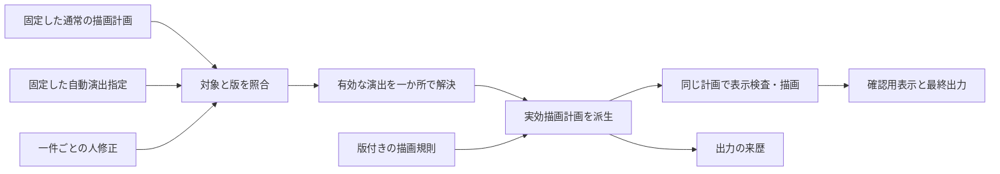

# OpenChatCut研究後のZEV接続候補 — 保存を小さくする案と描画能力の境界

2026-09-16。Checkpoint 3後も継続した、ZEV実装と保存資料の静的照合の結果。**設計候補であり、architecture・schema・Skill・実装の承認や着工ではない。**

前提と出典版は[Checkpoint 3報告](openchatcut-checkpoint3-20260916.md)と同じ。OpenChatCutは`8411023f8411f3c16538c3dab8fee4b7f9e97661`、ZEVの現物は`43380006bc4f8e1c902c067dcb53669790b6ce2c`。引用するZEV実装は公開済み`9f8fb04ac440c69466708e7ea529190b573f1089`と同じ内容である。既存の実装・成果物は変更せず、媒体の再生・解析やコードの実行もしていない。

## 1. 結論：四つの責務、追加する情報は二つ

**確定字幕と描画規則には既存の版付き参照を使い、新しく保持する情報を「固定した自動演出指定」と「一件ごとの人修正」に絞る案を推奨する。**

4状態案を、4つの新規ファイル、4つのregistry、新しい版管理サービスとして実装する必要はない。ファイルを一つにするか二つにするかも、現段階では決める必要がない。必要なのは、自動で決まった値と人が変えた値を区別し、固定した通常の描画計画から実効状態を再現できることである。

| 責務 | 既存のものを使う候補 | 追加して保持する情報 |
| --- | --- | --- |
| 確定字幕参照と本文・時刻の版 | 固定された共通描画計画、その中の表示字幕ID、元時刻を持つ投影記録への参照 | 原則は参照だけ。本文・改行・時刻の新しい複製を作らない |
| 固定した自動案 | 既存の依頼・結果・入力への束縛という方式 | 対象計画と判断の版に結び付いた、少数の演出指定と完了・例外情報 |
| 人修正 | 同じ対象計画と固定自動案への参照 | 表示字幕IDごとの、小さな置換内容 |
| 共通描画規則の版 | style・書体・renderer・文字配置規則のpathと内容hash | 新しい描画能力を追加する場合に、その実装版への参照を追加する。管理体系を複製しない |

**「通常計画」は演出前に固定した描画計画、「自動案」は自動演出の結果を戻り先として固定したものを指す。** 自動案の固定を、一件ずつ人間が事前承認する新しい操作にはしない。

## 2. 確定本文・時刻・IDの正本は既にある【事実】

表示字幕の投影処理は、本文片の全量・順序・改行、元動画の時刻と出力frameの対応を照合して、実際の表示字幕ごとのIDを作る。IDは計画の識別と通し番号から生成するため、全世代で単独の不変IDとして扱わず、**そのIDを含む固定計画と組み合わせて参照する**。[IDと本文の投影](https://github.com/f-kw/zev2/blob/9f8fb04ac440c69466708e7ea529190b573f1089/evals/clip_composition/digest_v1_phase2_caption_bridge.mts#L143)

共通描画計画は本文・出力frame・通常の外観・配置・文字索引・描画に使うregistryの識別を持つ。ただし、元動画時刻と区間IDを共通計画の該当欄へ保持しているわけではない。元時刻が必要な場合は、同じ生成物に結び付いた字幕の投影記録を参照する。共通計画だけで元動画への対応が全て揃うとは説明しない。[共通計画生成](https://github.com/f-kw/zev2/blob/9f8fb04ac440c69466708e7ea529190b573f1089/evals/clip_composition/run_presentation_instruction_renderer_job_v002.ts#L210)、[元時刻の投影記録](https://github.com/f-kw/zev2/blob/9f8fb04ac440c69466708e7ea529190b573f1089/evals/clip_composition/digest_v1_phase2_caption_bridge.mts#L167)

94pxのstyle派生は、schemaやpresetの名称を保ったまま、別path・内容hashで固定している。派生元や描画の信頼情報、計画、検査の参照も保持する。**preset名だけを新しい演出の版と呼ぶのは不足するが、既存の内容hash付き参照を使えばよい。** [styleの版と来歴](https://github.com/f-kw/zev2/blob/9f8fb04ac440c69466708e7ea529190b573f1089/evals/clip_composition/digest_v1_phase2_style94.mts#L171)

## 3. 一件修正とResetの最小状態【推論】

### 3.1 専用の三値を保存しなくても区別できる

一件ごとの人修正は、次の意味で足りる。

| 人修正の状態 | 実際に描くもの |
| --- | --- |
| 対象IDの項目がない | 固定自動案を継承する |
| 通常表示が明示されている | 自動演出を外し、固定通常計画の字幕を描く |
| 有限の演出指定がある | その一件を指定内容へ置き換える |

「自動案へ戻す」はその対象IDの人修正だけを削除する。通常表示へ変更することとは違う。自動案が要点強調なら、前者は要点強調に戻り、後者は通常表示になる。どちらも字幕自体は表示し続ける。

このため、「継承／削除／置換」という専用の状態列挙と、別の無効化flagを重ねて保存する必要はない。項目の有無と、許可された通常表示・演出内容で区別できる。自由なCSS値を受け取る意味ではなく、使用できる表現・強さ・範囲は別途確定する有限の入力に限定する。

### 3.2 変更済み計画へNormalを重ねても戻らない【事実】

現行試作は、未知ID、重複指定、未知の演出、余計な項目を拒否し、指定字幕だけの色・大きさを変える。無指定・空指定・全件通常表示なら、**渡された計画をそのまま返す**。[検査と対象限定](https://github.com/f-kw/zev2/blob/9f8fb04ac440c69466708e7ea529190b573f1089/evals/clip_composition/presentation_effects_v001.mjs#L20)

したがって、既に強調した計画を次の入力にして通常表示を指定しても、元の通常外観は復元しない。現行試作には、自動案と人修正を別保存し、固定基準へ戻す処理はない。[通常表示の返却](https://github.com/f-kw/zev2/blob/9f8fb04ac440c69466708e7ea529190b573f1089/evals/clip_composition/presentation_effects_v001.mjs#L73)

### 3.3 毎回固定通常計画から派生する【推論】

一件変更時に、自動判断を再実行したり、元の通常計画・自動案を書き換えたりしない。実効計画は出力の来歴へ保存できるが、別の編集正本にはしない。自動案が別の版へ変わったときに、人修正を無断で引き継ぐ機能も初期の最小案には含めない。

| 比較案 | 必要条件を満たすか | 最小性の判断 |
| --- | --- | --- |
| 現在の計画だけ保存する | 元の自動結果を失うため、同じ自動案へのResetを定義できない | 不足 |
| 自動案と編集可能な計画全体を保存する | 設計は可能 | 本文・時刻・改行・通常外観を複製し、ずれの検査が増える |
| 固定自動指定と小さな人修正を保存する | 固定通常計画から解決すれば可能 | 今回の要件に対する推奨候補 |

修正単位が「字幕一件」である限り、別の演出ID体系は必須ではない。後に同じ字幕内の複数演出を個別にResetする要件が加わった時点で、その識別を検討すればよい。文字範囲を持つことだけを理由に、新しい字幕IDや字幕の再分割を作らない。

## 4. 全字幕にNormal行を保存すべきか【推論】

**描画のためには、演出のある字幕だけを保存する疎な指定で足りる。** ただし省略された字幕を「判断済みの通常表示」と見なすには、対象字幕集合と判断の完了を別に確かめる必要がある。

最低限、固定した対象計画、処理対象の字幕集合、判断の依頼・結果、処理完了の状態を結び付ける。未完了・判断不能・現行単位での表現不能は例外として残し、通常表示へ混ぜない。これは新しいregistryではなく、自動案の成立条件と診断の記録である。

【事実】既存の表示区切りでも、回答が完了という形を満たすだけでなく、製造側が依頼の内容hash、回答と結果の一致、対象字幕IDの全量一致を照合する。[対象集合の照合](https://github.com/f-kw/zev2/blob/9f8fb04ac440c69466708e7ea529190b573f1089/evals/clip_composition/digest_v1_phase2_captions.mts#L57)

【推論】この責務分離は利用できるが、既存ダイジェストや字幕区切りの成功を演出判断の完了へ読み替えてはならない。また、全対象への処理完了は、重要な山の見落としゼロという意味品質の証明ではない。後者は[Checkpoint 3の四分類](openchatcut-checkpoint3-20260916.md#43-zevで分けるべき四つ)で別に扱う。

通常箇所すべてへ長い不採用理由を保存することは描画要件ではない。問題区間を説明するための判断記録と、実際に描くための小さな指定を分ければよい。人間の全件確認表を新設する提案でもない。

## 5. 現行rendererへの接続点【事実】

### 5.1 試作の入口はあるが、通常製造への配線はない

共通描画入口には、有限の演出指定を解決してから表示検査・字幕画像生成・合成へ進む箇所がある。外観を変えながら変更前の表示検査結果を渡す入力は拒否する。[演出解決と検査の順序](https://github.com/f-kw/zev2/blob/9f8fb04ac440c69466708e7ea529190b573f1089/evals/clip_composition/render_presentation_v002.mjs#L1551)

一方、通常の注文書からの呼出と現行ダイジェスト製造では、その演出指定を引き渡していない。注文書の結果へ返す計画も、演出反映前の共通計画である。将来の接続は引数を足すだけでなく、**実際に描いた計画と出力の来歴を一致させるところまで**必要になる。[通常入口の呼出](https://github.com/f-kw/zev2/blob/9f8fb04ac440c69466708e7ea529190b573f1089/evals/clip_composition/run_presentation_instruction_renderer_job_v002.ts#L431)、[結果へ残す計画](https://github.com/f-kw/zev2/blob/9f8fb04ac440c69466708e7ea529190b573f1089/evals/clip_composition/run_presentation_instruction_renderer_job_v002.ts#L464)

現行試作の演出名は通常・色強調・大きな反応に相当するもので、Focus／Vocal accentという役割設計とは区別する。値は人間比較のための暫定値であり、今回正式presetへ昇格させない。黒画面挿入は後続の時間を動かす別系統なので、今回の不変な字幕・基礎映像への後修正案から除く。[試作の型](https://github.com/f-kw/zev2/blob/9f8fb04ac440c69466708e7ea529190b573f1089/packages/shared/src/presentation-effects.ts#L1)、[比較の位置付け](https://github.com/f-kw/zev2/blob/9f8fb04ac440c69466708e7ea529190b573f1089/docs/reports/digest-effects-step2-comparisons-20260914.md#L3)

### 5.2 静止字幕の描画と、動く字幕は同じ能力ではない

現行の共通経路は、Remotionで字幕の静止PNGを一枚作り、FFmpegで表示期間と4frameの透明度fadeを適用する。OpenChatCutの単語motion・自由easing・各frameでの拡大移動が、同じように既に接続されているわけではない。[一frameの字幕画像](https://github.com/f-kw/zev2/blob/9f8fb04ac440c69466708e7ea529190b573f1089/evals/clip_composition/presentation_renderer_entry_v001.tsx#L692)、[時間方向の合成](https://github.com/f-kw/zev2/blob/9f8fb04ac440c69466708e7ea529190b573f1089/evals/clip_composition/render_presentation_v002.mjs#L923)

文字の索引はあるが、行全体へ一つの色・大きさを与える描画である。索引はUnicode code point単位で、結合文字や絵文字を一まとまりにした部分範囲契約ではない。**索引があることを、部分文字列の演出が実装済みという意味にしない。** [文字索引](https://github.com/f-kw/zev2/blob/9f8fb04ac440c69466708e7ea529190b573f1089/evals/clip_composition/presentation_renderer_text_layout_v001.mjs#L79)、[行単位の外観](https://github.com/f-kw/zev2/blob/9f8fb04ac440c69466708e7ea529190b573f1089/runner/src/remotion/components/TelopText.tsx#L99)

### 5.3 現行の物理検査が見ているもの

検査は、同じ文字配置計算による行数・行衝突・安全領域、実PNGの透明部分を除いた範囲、時間が重なる字幕同士の矩形衝突を扱う。顔やゲームの重要UIといった映像内容との衝突判定ではない。[配置検査](https://github.com/f-kw/zev2/blob/9f8fb04ac440c69466708e7ea529190b573f1089/evals/clip_composition/inspect_presentation_render_layout_v001.ts#L32)、[実画像と字幕間の衝突](https://github.com/f-kw/zev2/blob/9f8fb04ac440c69466708e7ea529190b573f1089/evals/clip_composition/presentation_renderer_qc_v002.mjs#L237)

【推論】部分範囲の拡大で字形や行幅を変えるなら、確定改行を保った状態で収まるか再確認が必要になる。移動・拡大するmotionには、通常状態の静止PNG一枚の合格だけでは不足する。演出期間を通した描画範囲を同じ時間規則から検証する責務が必要である。確認frame数や新しい許容係数は今回決めない。

### 5.4 現行previewを即時編集画面と扱わない

Step 2比較は、共通の演出解決・字幕画像生成・映像合成で作ったA/BのMP4を切り替えて見る方式である。一件を画面上で変更し、その場で完成描画へ反映するpreviewではない。[比較動画の生成](https://github.com/f-kw/zev2/blob/9f8fb04ac440c69466708e7ea529190b573f1089/evals/clip_composition/render_digest_effect_comparisons_v001.mjs#L69)

【推論】後修正画面を作る場合も、同じ実効計画と描画規則を確認用表示・最終出力に使う。操作中だけ別の字幅やmotionを描いて、それを完成出力と見なす仕組みにはしない。即時描画を最初から作るか、限定した確認出力を使うかは、必要な操作感と待ち時間に関する実測・製品判断を要する。

## 6. 実装に進むなら何を独立させるか【設計候補】

| 接続するもの | 最小の仕事 | 今あるものからは得られない点 |
| --- | --- | --- |
| 演出の入力と解決 | 固定計画・表示字幕ID・有限の役割を照合し、自動案と人修正を解決 | 自動案の固定、人修正とReset、対象版の検査は未実装 |
| 文字範囲の表現 | 本文・改行・時刻を変えず、その本文内の指定範囲だけ描き分ける | 現行の行全体styleとcode point索引だけでは不足 |
| 必要なmotion | 確定した時間軸と有限表現から毎frameの状態を決める | 現行の静止PNG＋固定fadeだけでは一般の移動・拡大を表せない |
| 後修正の操作 | 字幕一件を選び、演出削除・追加・強さ／範囲変更・自動案へ戻す | 現行A/B比較画面には保存を伴う一件編集がない |
| 来歴と検査 | 実際に描く計画、使った自動案・人修正・描画規則の版を結ぶ | 入力計画だけを結果へ残す現在の配線のままでは不足 |
| 自動配置 | 全文と必要な追加情報から要否・役割・対象を選び、未完了と表現不能を残す | 既存字幕Skillを改名してもこの判断にはならない |

演出の意味と描画能力を一度に大きく変えると、誤選択・見落とし・表現不能・描画不良の区別がつかなくなる。まず共通の有限入力と一件修正が通る成立見本を作り、その同じ入力へ自動選択を接続する順序には理由がある。ただし、これは着工指示ではない。

役割をAIへ選ばせる前にも、表現できない主対象を記録できる必要がある。全体しか変えられない初期試作を作る場合、それを部分範囲修正まで完成した製品とは扱わない。

## 7. 今は作らなくてよいもの【設計候補】

- 確定本文・時刻・改行を複製する新しい巨大編集計画。
- 既存のpath・内容hashと別に設ける、新しい版管理サービス。
- 自動案へ戻すための再AI実行、全projectの巻き戻し、毎frameの状態保存。
- 同じ字幕を世代をまたいで無断再対応させる移行・後方互換分岐。
- 自由な描画コード、無制限のCSS入力、汎用keyframe editor、NLE timeline。
- 上流の頻度・採点重み・色・大きさ・motion期間をそのまま採用すること。
- 候補一覧だけを見て発見率を合格にする評価、判断失敗をNormalへ落とす処理。
- 演出のためのProspect・保持区間・字幕境界・元時刻・基礎映像の再生成。

## 8. 静的調査の到達点と、本人の判断が必要な点

### OpenChatCutの実機導入は現時点の必須条件ではない

内部構造、保存の粒度、自由な描画作成の有無、既存ZEVとの接続差はsourceで答えられた。未実測なのは、主にZEVで新しく作る部分範囲・motion・一件修正の使い心地と、一本としての価値である。OpenChatCutを起動しても、未実装のZEV接続やZEVでのResetが成立した証明にはならない。

したがって、「動かしてみたい」ことを理由にCheckpoint 4のinstallを求めない。新しい問いが発生してOpenChatCut実機が不可欠になった場合だけ、dependency・通信・隔離・directory・disk見込み・具体command・残存物・cleanupを含む指定12項目を準備する。今回、導入や実行に進む必要性は確認できなかった。

### 次に固定する必要があるのは、最初の成立見本の製品範囲

**本人判断へ提示する問い：最初のZEV成立見本に、字幕全体の有限演出だけでなく、本文内の部分範囲を選び直せる能力まで含めるか。**

| 案 | 確かめられること | 残る制約 |
| --- | --- | --- |
| A：最初から部分範囲の強調と一件修正まで含める（推奨） | 長い字幕中の一語だけが主対象になる問題、範囲の後修正、自動案へ戻す構造を同じ見本で確かめられる | 現行描画への部分範囲表現と、その物理検査が新たに必要。具体的な見た目と必要motionは別途確定する |
| B：字幕全体の有限演出と一件修正から先に確かめる | 既存試作に近い配管で、全体を再判断せず修正・Resetする意味を先に確かめられる | 長い字幕内の主対象は表現不能として残り、範囲を直す要件は未完成のままになる |

推奨Aの理由は、今回求められた「強調範囲を後から直す」と、候補を発見しても現行単位では表現できない問題を、保存構造だけの話で終わらせないためである。単に機能数を増やすためではない。Bも段階的な技術見本としては成立するが、部分範囲を含む最終要件を落としてよいという提案ではない。

この範囲と実装着工は本人の判断が必要である。どちらも、現在許可された静的調査だけでは品質実証まで進めない。実装の承認が出たことにせず、**ここまでの成果を保存してZEV進行管理4へ判断を求める**。新しい見た目の値、費用、素材、作業path枠、開始時期は独断で設定しない。

## 9. 検証の意味と未実施事項

確認したのは、sourceの呼出・保存・拒否条件と、保存済み資料に何が記録されているかである。今回のテスト合格数や実動画評価はない。

未実装・未実証なのは、人修正の保存と再読込、固定自動案へのReset、部分範囲の見え方、動く字幕の全期間安全性、通常製造入口から演出反映後の来歴までの接続、自動選択の意味品質である。

将来の検証では、無指定時に通常経路を保つこと、一件変更で他字幕・本文・改行・時刻を変えないこと、再読込後も同じ自動案へ戻ること、版違いや不正指定を通常表示へ隠さず拒否すること、同じ入力から同じ確認表示と出力を得ることを直接確認する。必要性のない全字幕比較動画の再生成や、既存の除外済みQCの再開へ拡大しない。

## 10. Git保存と既存差分

| 項目 | 状態 |
| --- | --- |
| 研究branch | `codex/openchatcut-research-cp1` |
| CP3 commit | `f15fcccbd7a4454dc58339a796266608382d16fd` |
| CP3でcommitしたfile | `docs/reports/openchatcut-checkpoint3-20260916.md` 1件 |
| CP3 push | 完了。remote報告blob `c013c972595302dc0dc6d813e1aa953ac4184da3`とlocal一致 |
| CP3保存後の研究Git状態 | 未commit差分なし、localとremote tracking branchに未push差なし |
| CP3保存後の元作業ツリー | 開始時のGit状態と既存tracked差分に一致 |
| 今回の追加保存 | 本接続候補報告1件。確定commitとpush結果は最終回答へ記録 |

元の作業branchとHEAD、既存の方針文書差分1件、未追跡59,153件は変更しない。元作業ツリーへの書込みは0件。研究用checkoutには報告書だけを保存し、コード・素材・cache・dependency・無関係な既存commitを含めない。Git状態と既存tracked差分を保存後にも照合する。未追跡全件のbyte再hashは行わない。

本報告までに、OpenChatCutの導入・実行、build/test/dev server、環境追加、ZEVコード・schema・Skill変更、認証・鍵・環境変数読取、外部AI調査、素材送信は0件。公開source読取と承認済み報告push以外の新しい通信用途はなく、追加費用US$0。ZEV進行管理4への判断依頼は、ユーザーが指定した停止条件での相談経路として本報告を保存した後に行う。

## 11. ZEV進行管理4への報告と応答確認

2026-09-16 01:03 JSTに、Microsoft Edgeの[ZEV進行管理4](https://chatgpt.com/g/g-p-6a8aab6b92308191b44f77a03945fed4/c/6aa7f7e5-03d8-83ee-aae1-6c4b66fb8303)へ、CP3・本接続候補・前回CP2の保存先、主要所見、検証結果、本人判断へ提示するA/Bを送信した。最新ユーザー指示でcheckpointごとの承認待ちを廃止したことも共有した。

送信対象は報告の要約とcommitへのリンクであり、コード本文・素材・認証情報は送っていない。新規実装の指示書を自動作成・着工する依頼も送っていない。

| 保存・送信の確認 | 結果 |
| --- | --- |
| 本報告の監査対象commit | `f8158d59821214f526c490192005545c2669ce11` |
| このcommitの変更 | 本報告1fileのみ |
| pushと読戻し | 完了。remote blob `aa60a30410d9406a8f785dc4c88d9e0a226f8e62`とlocal一致 |
| 送信前の研究Git状態 | 未commit差分なし、未push差なし |
| 元作業ツリー | HEAD・branch・Git状態と既存tracked差分が開始時と一致。tracked差分1件、未追跡59,153件を維持、stage済み0件 |
| モデル条件 | 今回の固定モデル指定なし。現在の選択を維持、UIの思考量表示は「極高」。モデル切替なし |
| 送信・応答状態 | 対象会話内への表示と応答本文を確認。生成停止ボタンが消え、回答アクションが表示されたため「レスポンス確認済み」。更新・再生成・再送なし |

### 相談役から届いた回答

監査回答は、CP3と接続候補が各報告1fileのcommitであり、実装・schema・Skill変更を含めていないことを確認し、問題なしとした。

回答の見出しは「HUMAN_DECISION：Aを採用」。その内容は、最初の成立見本の合格条件に、部分範囲の強調、一件だけ通常表示へ戻すこと、通常箇所への演出追加、部分範囲の変更、保存済み自動案へのResetを含めるというものだった。

実装する場合の順序は、まず字幕全体の有限演出で固定通常計画・固定自動案・人修正・Resetを通し、その後、同じ構造に本文内の連続した文字範囲への静的強調と物理表示検査を加える。第2段階まで通して初めて成立見本の完成と扱う、という回答である。動的な反応演出の本実装、自動配置、新Skill、字幕再分割、語時刻推定、複数演出の組合せ、本格編集UI、OpenChatCut導入は、この最初の見本へ含めないと整理された。

OpenChatCut実機を現時点で導入しない判断、およびcheckpointごとの承認待ちをせず静的読取・調査・記録を続ける運用にも同意する応答だった。

**同じ回答には、実装着工の承認はまだ出さない旨が明記された。** 以上は相談役の応答を記録したもので、Codexが本人承認を新設した記録ではない。architectureやschemaを正本へ昇格させず、DECISIONS.mdにも記録しない。回答記録の保存・commit/push・Git照合を終えたところで今回のturnを終了し、新規実装には進まない。

この応答記録も本報告だけの追記として研究branchへ保存する。応答記録を含む最終commitとpush結果は最終回答へ記載する。
