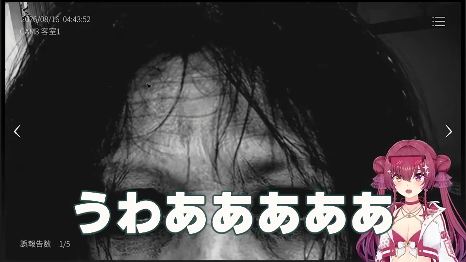
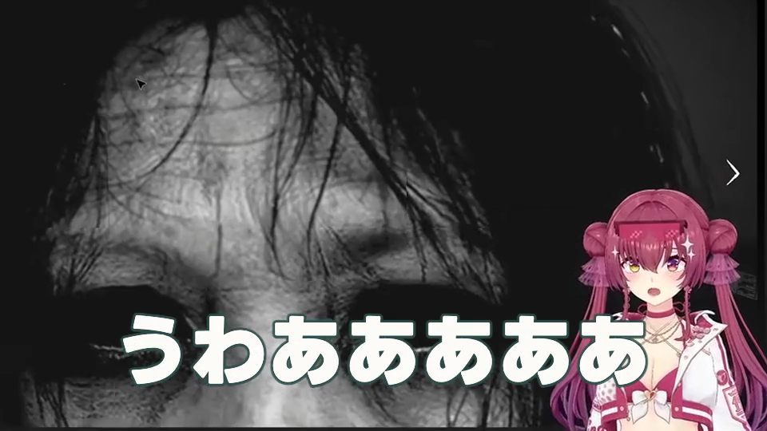

# 表情変化アップ最小実証 — 局所技術candidate

**result: candidate**。本編2の1箇所だけ、背景を右下へ1.2倍に寄せる有限状態を保存・再読・描画した。人物検出・自動トリガー・正式採用ではない。7A・7B・2色candidateは保持した。

## 承認と実行範囲

ユーザーの主線継続指示と13.4〜13.5完了後の表情アップ続行指示に基づき、ZEV相談役「ZEV Build Loop」が発行した「表情変化アップ演出 最小実証（kawafmm承認済み）」を実施した。指示原文とSHAは[検証記録](verification.json)から参照できる。開始mainは `424cb0e6ca7e6e81cca7489e2f27d6269094f704`。

今回の目的は低コストで局所アップが使えるか確かめること。新しいCV・追跡・API・STT・素材取得・1080p全編描画・production default変更は0。人間確認は最終統合確認へ残す。

## 調査と固定した1案

[棚卸し](inventory.json)には現素材7つの保存入口と既存crop実装3ファイルのSHA、該当JSON位置を保存した。

- 現素材の保存情報は `screenLayoutId: null`、全画面identity。顔／人物viewportは調査した入口にはない。
- 既存の正規化viewport・入力hash束縛・保存／再読の方式を参考にする。別素材の顔座標や縦動画の承認を流用しない。
- 既存の短区間抽出、字幕PNG、安全領域検査、fade付き字幕合成、音声・映像時計検査をそのまま使用する。
- 指示の分岐Bに従い、現在の配信キャラクターが右下に位置する4フレームを確認して、技術proof専用の固定cropを1つ選んだ。

| 項目 | 固定値 |
|---|---|
| 保存済み構成 | 本編2、表示frame 4162–11125未満 |
| proof区間 | 9708–9918未満、**05:23.600–05:30.600**、210frame／7秒 |
| アップ区間 | 9771–9853未満、**05:25.700–05:28.433…**、82frame |
| 文脈 | 既存字幕000119「うわあああああ」。明示的な技術見本であり表情認識結果ではない |
| 元動画対応 | 既存字幕のsource時計2180052–2182813msを保持 |
| 描画 | 960×540、30fps。normal-framing / reaction-close-upの2状態 |
| crop | x160 / y90 / 幅800 / 高さ450 → 960×540、1.2倍、瞬間切替 |
| 正規化viewport | 左1/6、上1/6、右1、下1。右・下の元画面端を保持 |

## 局所媒体

媒体は既存ignored成果物領域に保持し、Gitには追加していない。人間への途中確認依頼は行わない。

- [候補7秒](../../../runtime/artifacts/reaction-close-up-20260929-v001/proof-v002/candidate.mp4)
- [Normal解除7秒](../../../runtime/artifacts/reaction-close-up-20260929-v001/proof-v002/normal.mp4)
- [Reset後7秒](../../../runtime/artifacts/reaction-close-up-20260929-v001/proof-v002/reset.mp4)
- 保存先：`runtime/artifacts/reaction-close-up-20260929-v001/proof-v002/`

候補／Resetは双方1,523,602 bytes、SHA256 `c0b92e33896f4f4874149edfc2755e412e8bdfac25c6020e305cfd583d659425`。完全一致。

## 技術結果と画面上の制約

- 保存した配色viewから6字幕の全設定を再解決し、7Bの保存済み6PNGと完全一致する設定だけ再利用した。本文・改行・時計・色・サイズ・位置・Panel・Scale・縁・glow・fadeは変更していない。この局所区間にColor字幕はないが、参照する全体viewは採用candidateのYellow＋LightSkyBlueである。
- 全210frameの時計を確認。合成前の復号背景は指定82frameだけ変化し、残り128frameはNormalと完全一致。解除の全210frameは元短区間背景と完全一致。
- 字幕PNGのhash・alpha領域・safe areaを別processで再検査し、保存値との一致を確認。合成した4実フレームでは文字欠けなし。顔・目・口を字幕が覆わず、胸元への重なりは残る。
- アップ中も驚かせるゲーム内の顔と室内場面は残る。**左上の時刻／カメラ名、左下の報告数は2.733秒間crop外になる。** その情報の継続表示を要する別場面へ一般化しない。
- 髪・身体は元映像でも右端／下端からはみ出す。cropは同じ右・下端を維持し、局所観測で新たな顔切れはない。人物全身が入るという主張ではない。
- 音声は保存背景から切り出したfloat32 PCM一致を確認し、共通AACを一度生成して3媒体へコピー。3本のAAC packet・復号音声・時計は一致。44,100Hz、論理308,700sample／7秒。AAC末尾548sampleの扱いも既存検査で確認。
- Normal/offは同じ保存状態。Resetはoverrideを外し、保存candidateに戻る。保存結果の再読と3状態の実描画を確認した。
- MP4圧縮後の対象外画素が別encode間で全byte一致するとは主張しない。対象外不変の画素検査は合成前の背景と字幕PNGに対して行った。

| Normal同一時刻 | reaction-close-up |
|---|---|
|  |  |

見やすさ・面白さ・切替の快適さ・人間品質の正式採用は未確認。全素材自動追従、1080p完成品質、full replay/native全候補QCの代用にもしていない。

## 試験・独立再読

- [対象試験](tests.tap)：**12合格、失敗0、skip0**。有限状態、保存／Normal／Reset、viewport改変、別入力、未知操作、区間逸脱、子process失敗、未完了・欠損、実行command改ざん、別状態の媒体差替えを拒否。
- [既存回帰](regression.tap)：**10合格、失敗0、skip0**。短区間の時計／音声／scopeとfade局所合成を確認。13の35試験は実装不変の既存結果を参照し、今回の新しい試験数へ二重計上しない。
- 独立したNode processで、入力・実装・tool・保存状態・PNG・媒体hash、背景frame、音声、時計を再読した。結果は[verification.json](verification.json)。
- 保護対象の7A1080p候補、7B540p候補、13水色局所候補は既知SHAと再照合し、不変。

実行手順（repo root、未使用の出力directoryのみ）：

```sh
node tools/digest-quality/reaction-close-up-proof.mjs run runtime/artifacts/reaction-close-up-20260929-v001/proof-NEW
node tools/digest-quality/reaction-close-up-proof.mjs read runtime/artifacts/reaction-close-up-20260929-v001/proof-v002/completion.json
REACTION_PROOF_COMPLETION="$PWD/runtime/artifacts/reaction-close-up-20260929-v001/proof-v002/completion.json" node --test tools/digest-quality/reaction-close-up-policy.test.mjs tools/digest-quality/reaction-close-up-proof.test.mjs
node --test evals/clip_composition/presentation_dev_proxy_render_v001.test.mjs evals/clip_composition/presentation_composite_fade_localization_v001.test.mjs
```

新規状態・検証器はこの固定局所proofだけを対象とする。未使用directoryにのみ保存し、旧renderer・旧trust/registryを変更していない。

## 時間・資源・途中修正

2026-09-29 **21:58:23–21:58:43 JST**のv002が有効な実走。

- 3状態の作成・検査を含むcommand全体：**20.822秒**。各状態の背景作成＋字幕合成＋媒体確認は候補4.248秒、解除4.267秒、Reset4.209秒（全体の内訳）。
- 別process独立再読：**11.808秒**。
- Node親最大RSS：実走490,864,640 bytes、再読483,803,136 bytes。子tool最大値・同時総ピーク・物理I/Oは未計測。
- 有効proof directory：112,874,221論理bytes。旧版・局所frame・ログも含む今回成果物領域は記録時194,999,832論理bytes。再現／失敗来歴として保持する新規媒体であり、旧成果物の掃除はしていない。
- 初回の新規policy試験は括弧の構文ミスで起動失敗し、修正後5/5、最終対象試験12/12。
- v001ではNormal背景の入力／出力pathが同じだったため、独立出力の証明に使わない。元証拠を保持し、別path強制を入れて7秒3状態をv002で再実行した。全編再描画はしていない。

## 完了範囲と残件

既存資産棚卸し、現素材確認、固定crop1案、局所540p、保存・再読、Normal/Reset、字幕共存、対象試験・既存回帰、軽量記録まで成立。人間品質は最終確認へ残す。

自動表情認識や汎用cropは追加しない。次の統合candidateは相談役の個別指示による。

報告経路：旧相談役の会話長上限で未送信だったが、ユーザーの再開指示を受け、2026-09-29 23:57 JSTに新しい[ZEV Build Loop](https://chatgpt.com/g/g-p-6a8aab6b92308191b44f77a03945fed4-zevxiang-tan-yi/c/6abbcacc-8c98-83ee-9276-248a1d29b047)へ直接送信し、本文表示と監査応答を確認した。GitHubとの整合を確認する応答を受領し、[既存改善の統合準備](../integration-preparation-20260930/README.md)へ続行した。人間品質・正式採用は未確認のまま。
