# 境界検証パッケージ

- 判定目的: 旧確認済みペアの境界と、DP連続対応から組んだ新仮説の境界を人間が比較する。
- 判定はこのレポートでは行わない。
- confirmedペア、fixture、expected、照合ロジックは変更していない。
- HTML index: `../outputs/boundary-check/r_ztjHaHmcg/20260706-final-block-boundary-v001/index.html`

## 新仮説

- clip: 1:27.475-2:01.147
- source: 39:59.621-40:40.868
- 補助: source最終語開始 40:36.085
- 根拠: 修復ありDPの連続対応。57語直線分を開始軸にし、後続の連続対応を終端まで連結。

## 旧ペアとの差分

| 境界 | 旧clip | 新clip | clip差分 | 旧source | 新source | source差分 |
| --- | ---: | ---: | ---: | ---: | ---: | ---: |
| 開始 | 1:32.555 | 1:27.475 | -5080ms | 40:04.730 | 39:59.621 | -5109ms |
| 終端 | 2:01.147 | 2:01.147 | +0ms | 40:33.322 | 40:40.868 | +7546ms |

## 確認ポイント

- 開始側: clip 1:27.475 / source 39:59.621 と、clip 1:32.555 / source 40:04.730 のどちらが実際の切り出し開始か。
- 終端側: source 40:33.322 と、source 40:36.085-40:40.868 のどちらがclip 2:01.147終端に対応するか。
- source 40:36.085 は最終語「ね」の開始で、40:40.868 はSTT上の最終語終了。長い最終語なので両方を確認対象に入れている。

## 境界別素材

### clip 新開始候補 1:27.475

- 意味: 新仮説の開始。57語直線分の開始点。
- 音声: `../outputs/boundary-check/r_ztjHaHmcg/20260706-final-block-boundary-v001/audio/clip_new_start_pm2s.wav`
- 静止画: `../outputs/boundary-check/r_ztjHaHmcg/20260706-final-block-boundary-v001/stills/clip_new_start/clip_new_start_minus2s.jpg`, `../outputs/boundary-check/r_ztjHaHmcg/20260706-final-block-boundary-v001/stills/clip_new_start/clip_new_start_minus1s.jpg`, `../outputs/boundary-check/r_ztjHaHmcg/20260706-final-block-boundary-v001/stills/clip_new_start/clip_new_start_exact.jpg`, `../outputs/boundary-check/r_ztjHaHmcg/20260706-final-block-boundary-v001/stills/clip_new_start/clip_new_start_plus1s.jpg`, `../outputs/boundary-check/r_ztjHaHmcg/20260706-final-block-boundary-v001/stills/clip_new_start/clip_new_start_plus2s.jpg`

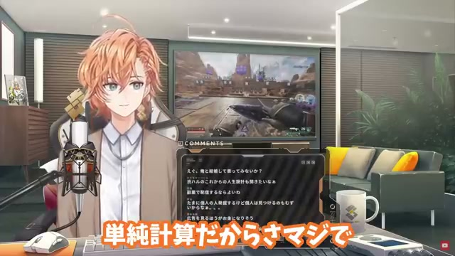
### clip 旧開始 1:32.555

- 意味: 旧確認済みペアの開始。57語直線分の内部。
- 音声: `../outputs/boundary-check/r_ztjHaHmcg/20260706-final-block-boundary-v001/audio/clip_old_start_pm2s.wav`
- 静止画: `../outputs/boundary-check/r_ztjHaHmcg/20260706-final-block-boundary-v001/stills/clip_old_start/clip_old_start_minus2s.jpg`, `../outputs/boundary-check/r_ztjHaHmcg/20260706-final-block-boundary-v001/stills/clip_old_start/clip_old_start_minus1s.jpg`, `../outputs/boundary-check/r_ztjHaHmcg/20260706-final-block-boundary-v001/stills/clip_old_start/clip_old_start_exact.jpg`, `../outputs/boundary-check/r_ztjHaHmcg/20260706-final-block-boundary-v001/stills/clip_old_start/clip_old_start_plus1s.jpg`, `../outputs/boundary-check/r_ztjHaHmcg/20260706-final-block-boundary-v001/stills/clip_old_start/clip_old_start_plus2s.jpg`

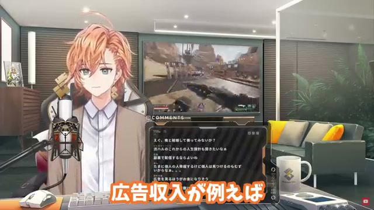

### source 新開始候補 39:59.621

- 意味: 新仮説の開始。57語直線分の開始点。
- 音声: `../outputs/boundary-check/r_ztjHaHmcg/20260706-final-block-boundary-v001/audio/source_new_start_pm2s.wav`
- 静止画: `../outputs/boundary-check/r_ztjHaHmcg/20260706-final-block-boundary-v001/stills/source_new_start/source_new_start_minus2s.jpg`, `../outputs/boundary-check/r_ztjHaHmcg/20260706-final-block-boundary-v001/stills/source_new_start/source_new_start_minus1s.jpg`, `../outputs/boundary-check/r_ztjHaHmcg/20260706-final-block-boundary-v001/stills/source_new_start/source_new_start_exact.jpg`, `../outputs/boundary-check/r_ztjHaHmcg/20260706-final-block-boundary-v001/stills/source_new_start/source_new_start_plus1s.jpg`, `../outputs/boundary-check/r_ztjHaHmcg/20260706-final-block-boundary-v001/stills/source_new_start/source_new_start_plus2s.jpg`

### source 旧開始 40:04.730

- 意味: 旧確認済みペアの開始。57語直線分の内部。
- 音声: `../outputs/boundary-check/r_ztjHaHmcg/20260706-final-block-boundary-v001/audio/source_old_start_pm2s.wav`
- 静止画: `../outputs/boundary-check/r_ztjHaHmcg/20260706-final-block-boundary-v001/stills/source_old_start/source_old_start_minus2s.jpg`, `../outputs/boundary-check/r_ztjHaHmcg/20260706-final-block-boundary-v001/stills/source_old_start/source_old_start_minus1s.jpg`, `../outputs/boundary-check/r_ztjHaHmcg/20260706-final-block-boundary-v001/stills/source_old_start/source_old_start_exact.jpg`, `../outputs/boundary-check/r_ztjHaHmcg/20260706-final-block-boundary-v001/stills/source_old_start/source_old_start_plus1s.jpg`, `../outputs/boundary-check/r_ztjHaHmcg/20260706-final-block-boundary-v001/stills/source_old_start/source_old_start_plus2s.jpg`

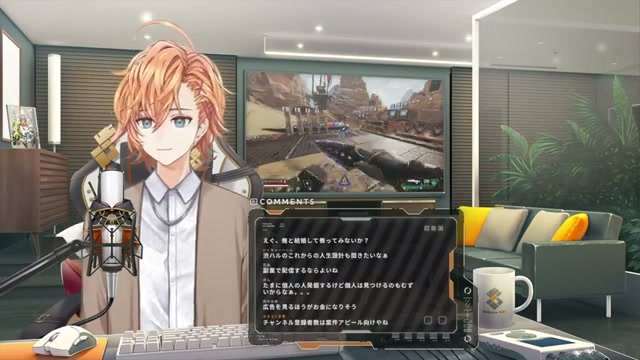

### clip 新旧共通終端 2:01.147

- 意味: 新旧どちらも同じclip終端。
- 音声: `../outputs/boundary-check/r_ztjHaHmcg/20260706-final-block-boundary-v001/audio/clip_shared_end_pm2s.wav`
- 静止画: `../outputs/boundary-check/r_ztjHaHmcg/20260706-final-block-boundary-v001/stills/clip_shared_end/clip_shared_end_minus2s.jpg`, `../outputs/boundary-check/r_ztjHaHmcg/20260706-final-block-boundary-v001/stills/clip_shared_end/clip_shared_end_minus1s.jpg`, `../outputs/boundary-check/r_ztjHaHmcg/20260706-final-block-boundary-v001/stills/clip_shared_end/clip_shared_end_exact.jpg`, `../outputs/boundary-check/r_ztjHaHmcg/20260706-final-block-boundary-v001/stills/clip_shared_end/clip_shared_end_plus1s.jpg`, `../outputs/boundary-check/r_ztjHaHmcg/20260706-final-block-boundary-v001/stills/clip_shared_end/clip_shared_end_plus2s.jpg`

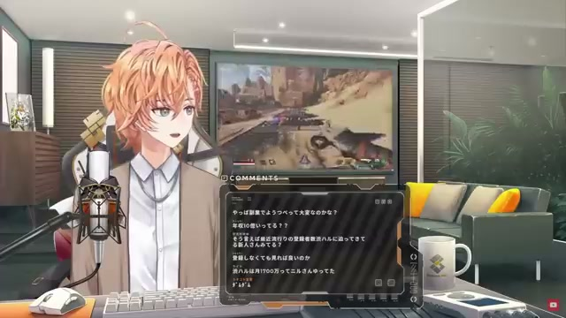
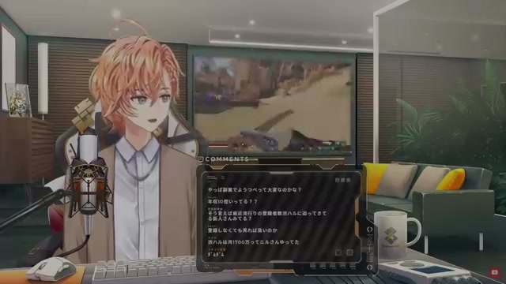
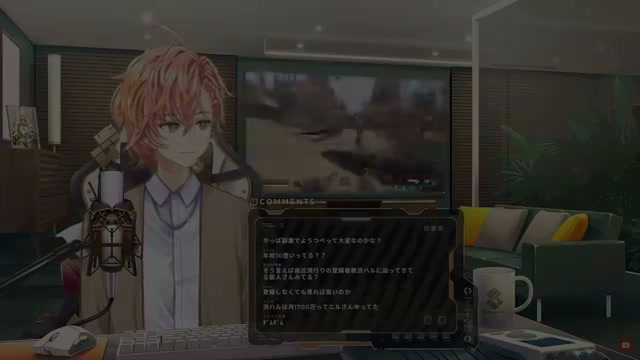

### source 旧終端 40:33.322

- 意味: 旧確認済みペアのsource終端。STT上では「変」の途中。
- 音声: `../outputs/boundary-check/r_ztjHaHmcg/20260706-final-block-boundary-v001/audio/source_old_end_pm2s.wav`
- 静止画: `../outputs/boundary-check/r_ztjHaHmcg/20260706-final-block-boundary-v001/stills/source_old_end/source_old_end_minus2s.jpg`, `../outputs/boundary-check/r_ztjHaHmcg/20260706-final-block-boundary-v001/stills/source_old_end/source_old_end_minus1s.jpg`, `../outputs/boundary-check/r_ztjHaHmcg/20260706-final-block-boundary-v001/stills/source_old_end/source_old_end_exact.jpg`, `../outputs/boundary-check/r_ztjHaHmcg/20260706-final-block-boundary-v001/stills/source_old_end/source_old_end_plus1s.jpg`, `../outputs/boundary-check/r_ztjHaHmcg/20260706-final-block-boundary-v001/stills/source_old_end/source_old_end_plus2s.jpg`

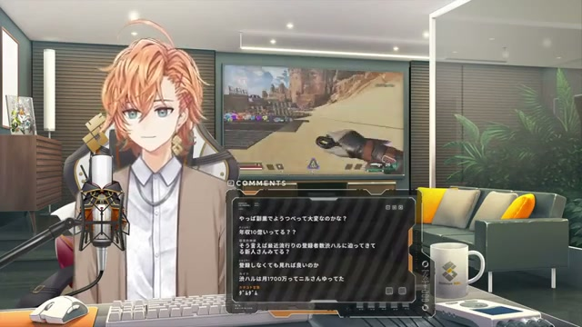
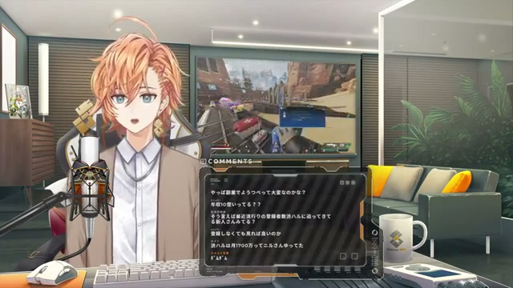

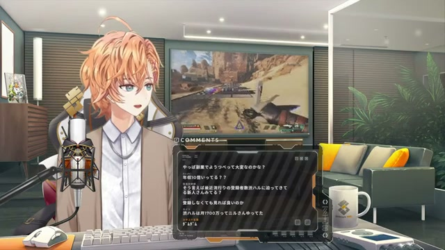
### source 新終端補助 40:36.085

- 意味: 新仮説終端の最終語「ね」の開始。長い最終語の下限確認用。
- 音声: `../outputs/boundary-check/r_ztjHaHmcg/20260706-final-block-boundary-v001/audio/source_new_end_last_word_start_pm2s.wav`
- 静止画: `../outputs/boundary-check/r_ztjHaHmcg/20260706-final-block-boundary-v001/stills/source_new_end_last_word_start/source_new_end_last_word_start_minus2s.jpg`, `../outputs/boundary-check/r_ztjHaHmcg/20260706-final-block-boundary-v001/stills/source_new_end_last_word_start/source_new_end_last_word_start_minus1s.jpg`, `../outputs/boundary-check/r_ztjHaHmcg/20260706-final-block-boundary-v001/stills/source_new_end_last_word_start/source_new_end_last_word_start_exact.jpg`, `../outputs/boundary-check/r_ztjHaHmcg/20260706-final-block-boundary-v001/stills/source_new_end_last_word_start/source_new_end_last_word_start_plus1s.jpg`, `../outputs/boundary-check/r_ztjHaHmcg/20260706-final-block-boundary-v001/stills/source_new_end_last_word_start/source_new_end_last_word_start_plus2s.jpg`

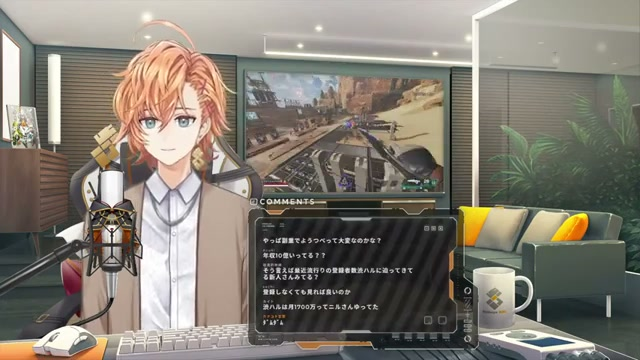
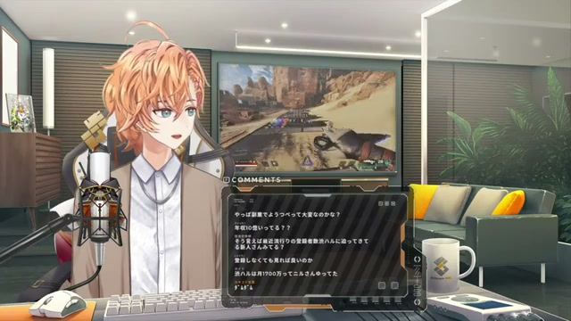
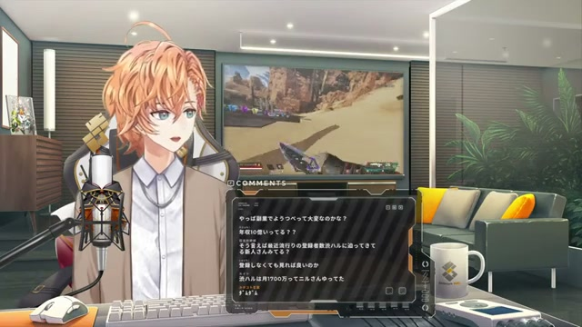
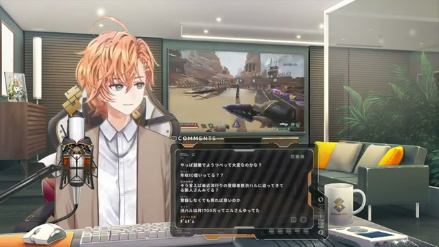
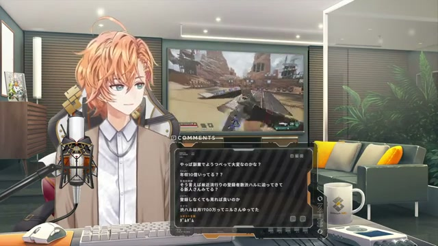
### source 新終端候補 40:40.868

- 意味: 新仮説のsource終端。修復後DPの最終対応語の終了点。
- 音声: `../outputs/boundary-check/r_ztjHaHmcg/20260706-final-block-boundary-v001/audio/source_new_end_pm2s.wav`
- 静止画: `../outputs/boundary-check/r_ztjHaHmcg/20260706-final-block-boundary-v001/stills/source_new_end/source_new_end_minus2s.jpg`, `../outputs/boundary-check/r_ztjHaHmcg/20260706-final-block-boundary-v001/stills/source_new_end/source_new_end_minus1s.jpg`, `../outputs/boundary-check/r_ztjHaHmcg/20260706-final-block-boundary-v001/stills/source_new_end/source_new_end_exact.jpg`, `../outputs/boundary-check/r_ztjHaHmcg/20260706-final-block-boundary-v001/stills/source_new_end/source_new_end_plus1s.jpg`, `../outputs/boundary-check/r_ztjHaHmcg/20260706-final-block-boundary-v001/stills/source_new_end/source_new_end_plus2s.jpg`

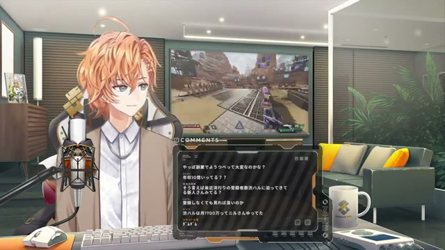
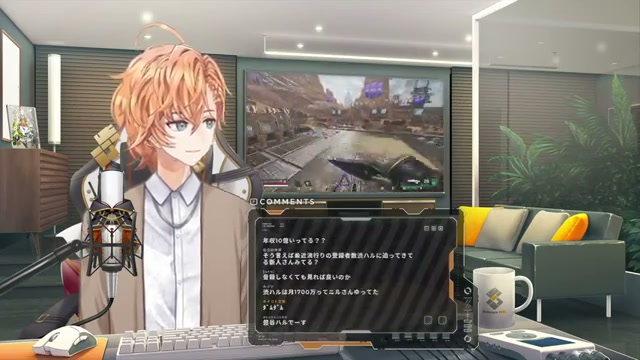

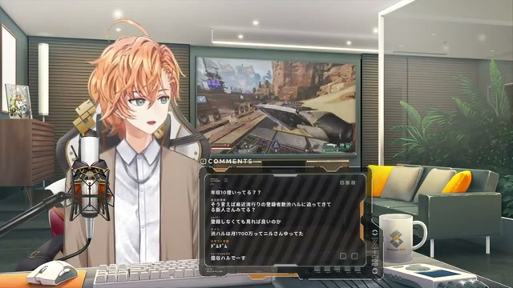
