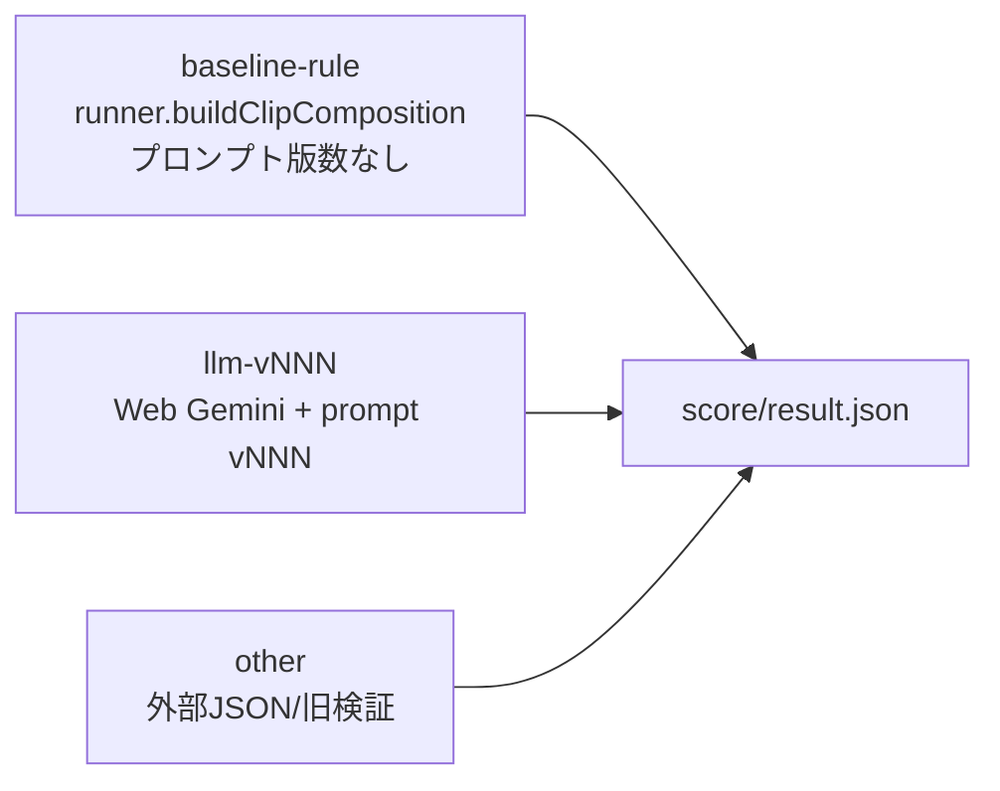

# clip_composition 測定対象の配線図

- 結果JSON: outputs/generation-system-map-20260706-v002.json
- 対象: result.json のうち prompt v001〜v006 と baseline-rule

## 件数

| 生成系統 | 件数 | 区間を実際に生成したもの |
| --- | ---: | --- |
| baseline-rule | 24 | runner.buildClipComposition |
| llm-v001 | 4 | web-gemini+prompt |
| llm-v002 | 2 | web-gemini+prompt |
| llm-v003 | 2 | web-gemini+prompt |
| llm-v004 | 2 | web-gemini+prompt |
| llm-v005 | 2 | web-gemini+prompt |
| llm-v006 | 3 | web-gemini+prompt |
| other-rule-output-score | 2 | rule-output-json-rescored-as-external-input |

## 対応表

| fixture | prompt label | system | generated by | model | runAt | result |
| --- | --- | --- | --- | --- | --- | --- |
| draft_w4Lp9IJC6pQl3FsRfFL9t | clip_composition_prompt_v001 | baseline-rule (legacy inferred) | runner.buildClipComposition | rule-based-build_clip_composition | 2026-07-04T14:48:25+09:00 | evals/clip_composition/outputs/draft_w4Lp9IJC6pQl3FsRfFL9t/clip_composition_prompt_v001/20260704-144825/result.json |
| IMQYaT_RWRA_audio_v001 | clip_composition_prompt_v001 | baseline-rule (legacy inferred) | runner.buildClipComposition | rule-based-build_clip_composition | 2026-07-05T12:22:24+09:00 | evals/clip_composition/outputs/IMQYaT_RWRA_audio_v001/clip_composition_prompt_v001/20260705-122224/result.json |
| IMQYaT_RWRA_audio_v001 | clip_composition_prompt_v001 | baseline-rule (legacy inferred) | runner.buildClipComposition | rule-based-build_clip_composition | 2026-07-05T12:22:30+09:00 | evals/clip_composition/outputs/IMQYaT_RWRA_audio_v001/clip_composition_prompt_v001/20260705-122230/result.json |
| IMQYaT_RWRA_audio_v001 | clip_composition_prompt_v001 | baseline-rule (legacy inferred) | runner.buildClipComposition | rule-based-build_clip_composition | 2026-07-05T12:23:00+09:00 | evals/clip_composition/outputs/IMQYaT_RWRA_audio_v001/clip_composition_prompt_v001/20260705-122300/result.json |
| IMQYaT_RWRA_audio_v001 | clip_composition_prompt_v001 | baseline-rule (legacy inferred) | runner.buildClipComposition | rule-based-build_clip_composition | 2026-07-05T12:30:51+09:00 | evals/clip_composition/outputs/IMQYaT_RWRA_audio_v001/clip_composition_prompt_v001/20260705-123051/result.json |
| IMQYaT_RWRA_audio_v001 | clip_composition_prompt_v001 | baseline-rule (legacy inferred) | runner.buildClipComposition | rule-based-build_clip_composition | 2026-07-05T12:37:25+09:00 | evals/clip_composition/outputs/IMQYaT_RWRA_audio_v001/clip_composition_prompt_v001/20260705-123725/result.json |
| IMQYaT_RWRA_clip_audio_v001 | clip_composition_prompt_v001 | baseline-rule (legacy inferred) | runner.buildClipComposition | rule-based-build_clip_composition | 2026-07-05T22:50:28+09:00 | evals/clip_composition/outputs/IMQYaT_RWRA_clip_audio_v001/clip_composition_prompt_v001/20260705-225028/result.json |
| IMQYaT_RWRA_clip_audio_v001 | clip_composition_prompt_v001 | baseline-rule (legacy inferred) | runner.buildClipComposition | rule-based-build_clip_composition | 2026-07-05T22:55:51+09:00 | evals/clip_composition/outputs/IMQYaT_RWRA_clip_audio_v001/clip_composition_prompt_v001/20260705-225551/result.json |
| IMQYaT_RWRA_clip_audio_v001 | clip_composition_prompt_v001 | llm-v001 (legacy inferred) | web-gemini+prompt | gemini-web-flash | 2026-07-05T13:02:27+09:00 | evals/clip_composition/outputs/IMQYaT_RWRA_clip_audio_v001/clip_composition_prompt_v001/20260705-130227/result.json |
| IMQYaT_RWRA_clip_audio_v001 | clip_composition_prompt_v001 | llm-v001 (legacy inferred) | web-gemini+prompt | gemini-web-flash | 2026-07-05T13:14:40+09:00 | evals/clip_composition/outputs/IMQYaT_RWRA_clip_audio_v001/clip_composition_prompt_v001/20260705-131440/result.json |
| IMQYaT_RWRA_clip_audio_v001 | clip_composition_prompt_v001 | other-rule-output-score (legacy inferred) | rule-output-json-rescored-as-external-input | rule-based-result-as-external | 2026-07-05T22:50:36+09:00 | evals/clip_composition/outputs/IMQYaT_RWRA_clip_audio_v001/clip_composition_prompt_v001/20260705-225036/result.json |
| IMQYaT_RWRA_context_v001 | clip_composition_prompt_v001 | baseline-rule (legacy inferred) | runner.buildClipComposition | rule-based-build_clip_composition | 2026-07-05T12:45:45+09:00 | evals/clip_composition/outputs/IMQYaT_RWRA_context_v001/clip_composition_prompt_v001/20260705-124545/result.json |
| IMQYaT_RWRA_context_v001 | clip_composition_prompt_v001 | llm-v001 (legacy inferred) | web-gemini+prompt | gemini-web-flash | 2026-07-05T12:58:36+09:00 | evals/clip_composition/outputs/IMQYaT_RWRA_context_v001/clip_composition_prompt_v001/20260705-125836/result.json |
| IMQYaT_RWRA_context_v001 | clip_composition_prompt_v001 | llm-v001 (legacy inferred) | web-gemini+prompt | gemini-web-flash | 2026-07-05T15:36:14+09:00 | evals/clip_composition/outputs/IMQYaT_RWRA_context_v001/clip_composition_prompt_v001/20260705-153614/result.json |
| IMQYaT_RWRA_context_v001 | clip_composition_prompt_v002 | llm-v002 (legacy inferred) | web-gemini+prompt | gemini-web-flash | 2026-07-05T13:24:23+09:00 | evals/clip_composition/outputs/IMQYaT_RWRA_context_v001/clip_composition_prompt_v002/20260705-132423/result.json |
| IMQYaT_RWRA_context_v001 | clip_composition_prompt_v002 | llm-v002 (legacy inferred) | web-gemini+prompt | gemini-web-flash | 2026-07-05T15:36:17+09:00 | evals/clip_composition/outputs/IMQYaT_RWRA_context_v001/clip_composition_prompt_v002/20260705-153617/result.json |
| IMQYaT_RWRA_context_v001 | clip_composition_prompt_v003 | llm-v003 (legacy inferred) | web-gemini+prompt | gemini-web-flash | 2026-07-05T13:29:05+09:00 | evals/clip_composition/outputs/IMQYaT_RWRA_context_v001/clip_composition_prompt_v003/20260705-132905/result.json |
| IMQYaT_RWRA_context_v001 | clip_composition_prompt_v003 | llm-v003 (legacy inferred) | web-gemini+prompt | gemini-web-flash | 2026-07-05T15:36:16+09:00 | evals/clip_composition/outputs/IMQYaT_RWRA_context_v001/clip_composition_prompt_v003/20260705-153616/result.json |
| IMQYaT_RWRA_context_v001 | clip_composition_prompt_v004 | llm-v004 (legacy inferred) | web-gemini+prompt | gemini-web-flash | 2026-07-05T13:31:30+09:00 | evals/clip_composition/outputs/IMQYaT_RWRA_context_v001/clip_composition_prompt_v004/20260705-133130/result.json |
| IMQYaT_RWRA_context_v001 | clip_composition_prompt_v004 | llm-v004 (legacy inferred) | web-gemini+prompt | gemini-web-flash | 2026-07-05T15:36:14+09:00 | evals/clip_composition/outputs/IMQYaT_RWRA_context_v001/clip_composition_prompt_v004/20260705-153614/result.json |
| IMQYaT_RWRA_context_v001 | clip_composition_prompt_v005 | llm-v005 (legacy inferred) | web-gemini+prompt | gemini-web-flash | 2026-07-05T13:34:48+09:00 | evals/clip_composition/outputs/IMQYaT_RWRA_context_v001/clip_composition_prompt_v005/20260705-133448/result.json |
| IMQYaT_RWRA_context_v001 | clip_composition_prompt_v005 | llm-v005 (legacy inferred) | web-gemini+prompt | gemini-web-flash | 2026-07-05T15:36:14+09:00 | evals/clip_composition/outputs/IMQYaT_RWRA_context_v001/clip_composition_prompt_v005/20260705-153614/result.json |
| IMQYaT_RWRA_context_v001 | clip_composition_prompt_v006 | llm-v006 (legacy inferred) | web-gemini+prompt | gemini-web-flash | 2026-07-05T15:35:41+09:00 | evals/clip_composition/outputs/IMQYaT_RWRA_context_v001/clip_composition_prompt_v006/20260705-153541/result.json |
| IMQYaT_RWRA_context_v001 | clip_composition_prompt_v006 | llm-v006 (legacy inferred) | web-gemini+prompt | gemini-web-flash | 2026-07-05T17:45:46+09:00 | evals/clip_composition/outputs/IMQYaT_RWRA_context_v001/clip_composition_prompt_v006/20260705-174546/result.json |
| IMQYaT_RWRA_context_v001 | clip_composition_prompt_v001 | other-rule-output-score (legacy inferred) | rule-output-json-rescored-as-external-input | rule-output-smoke | 2026-07-05T12:52:15+09:00 | evals/clip_composition/outputs/IMQYaT_RWRA_context_v001/clip_composition_prompt_v001/20260705-125215/result.json |
| r_ztjHaHmcg_partial_material_v001 | clip_composition_prompt_v001 | baseline-rule (legacy inferred) | runner.buildClipComposition | rule-based-build_clip_composition | 2026-07-06T14:25:03+09:00 | evals/clip_composition/outputs/r_ztjHaHmcg_partial_material_v001/clip_composition_prompt_v001/20260706-142503/result.json |
| r_ztjHaHmcg_partial_material_v001 | clip_composition_prompt_v002 | baseline-rule (legacy inferred) | runner.buildClipComposition | rule-based-build_clip_composition | 2026-07-06T14:25:03+09:00 | evals/clip_composition/outputs/r_ztjHaHmcg_partial_material_v001/clip_composition_prompt_v002/20260706-142503/result.json |
| r_ztjHaHmcg_partial_material_v001 | clip_composition_prompt_v003 | baseline-rule (legacy inferred) | runner.buildClipComposition | rule-based-build_clip_composition | 2026-07-06T14:25:03+09:00 | evals/clip_composition/outputs/r_ztjHaHmcg_partial_material_v001/clip_composition_prompt_v003/20260706-142503/result.json |
| r_ztjHaHmcg_partial_material_v001 | clip_composition_prompt_v004 | baseline-rule (legacy inferred) | runner.buildClipComposition | rule-based-build_clip_composition | 2026-07-06T14:25:04+09:00 | evals/clip_composition/outputs/r_ztjHaHmcg_partial_material_v001/clip_composition_prompt_v004/20260706-142504/result.json |
| r_ztjHaHmcg_partial_material_v001 | clip_composition_prompt_v005 | baseline-rule (legacy inferred) | runner.buildClipComposition | rule-based-build_clip_composition | 2026-07-06T14:25:03+09:00 | evals/clip_composition/outputs/r_ztjHaHmcg_partial_material_v001/clip_composition_prompt_v005/20260706-142503/result.json |
| r_ztjHaHmcg_partial_material_v001 | clip_composition_prompt_v006 | baseline-rule (legacy inferred) | runner.buildClipComposition | rule-based-build_clip_composition | 2026-07-06T14:25:03+09:00 | evals/clip_composition/outputs/r_ztjHaHmcg_partial_material_v001/clip_composition_prompt_v006/20260706-142503/result.json |
| r_ztjHaHmcg_partial_material_v001 | baseline-rule | baseline-rule | runner.buildClipComposition | baseline-rule | 2026-07-06T14:37:28+09:00 | evals/clip_composition/outputs/r_ztjHaHmcg_partial_material_v001/baseline-rule/20260706-143728/result.json |
| UpRyakf5j80_clip_audio_v001 | clip_composition_prompt_v001 | baseline-rule (legacy inferred) | runner.buildClipComposition | rule-based-build_clip_composition | 2026-07-05T18:40:34+09:00 | evals/clip_composition/outputs/UpRyakf5j80_clip_audio_v001/clip_composition_prompt_v001/20260705-184034/result.json |
| UpRyakf5j80_clip_audio_v001 | clip_composition_prompt_v001 | baseline-rule (legacy inferred) | runner.buildClipComposition | rule-based-build_clip_composition | 2026-07-06T14:24:04+09:00 | evals/clip_composition/outputs/UpRyakf5j80_clip_audio_v001/clip_composition_prompt_v001/20260706-142404/result.json |
| UpRyakf5j80_clip_audio_v001 | clip_composition_prompt_v002 | baseline-rule (legacy inferred) | runner.buildClipComposition | rule-based-build_clip_composition | 2026-07-06T14:24:32+09:00 | evals/clip_composition/outputs/UpRyakf5j80_clip_audio_v001/clip_composition_prompt_v002/20260706-142432/result.json |
| UpRyakf5j80_clip_audio_v001 | clip_composition_prompt_v003 | baseline-rule (legacy inferred) | runner.buildClipComposition | rule-based-build_clip_composition | 2026-07-06T14:24:33+09:00 | evals/clip_composition/outputs/UpRyakf5j80_clip_audio_v001/clip_composition_prompt_v003/20260706-142433/result.json |
| UpRyakf5j80_clip_audio_v001 | clip_composition_prompt_v004 | baseline-rule (legacy inferred) | runner.buildClipComposition | rule-based-build_clip_composition | 2026-07-06T14:24:33+09:00 | evals/clip_composition/outputs/UpRyakf5j80_clip_audio_v001/clip_composition_prompt_v004/20260706-142433/result.json |
| UpRyakf5j80_clip_audio_v001 | clip_composition_prompt_v005 | baseline-rule (legacy inferred) | runner.buildClipComposition | rule-based-build_clip_composition | 2026-07-06T14:24:34+09:00 | evals/clip_composition/outputs/UpRyakf5j80_clip_audio_v001/clip_composition_prompt_v005/20260706-142434/result.json |
| UpRyakf5j80_clip_audio_v001 | clip_composition_prompt_v006 | baseline-rule (legacy inferred) | runner.buildClipComposition | rule-based-build_clip_composition | 2026-07-06T14:24:34+09:00 | evals/clip_composition/outputs/UpRyakf5j80_clip_audio_v001/clip_composition_prompt_v006/20260706-142434/result.json |
| UpRyakf5j80_clip_audio_v001 | baseline-rule | baseline-rule | runner.buildClipComposition | baseline-rule | 2026-07-06T14:37:17+09:00 | evals/clip_composition/outputs/UpRyakf5j80_clip_audio_v001/baseline-rule/20260706-143717/result.json |
| UpRyakf5j80_clip_audio_v001 | clip_composition_prompt_v006 | llm-v006 (legacy inferred) | web-gemini+prompt | gemini-web-flash | 2026-07-05T18:46:16+09:00 | evals/clip_composition/outputs/UpRyakf5j80_clip_audio_v001/clip_composition_prompt_v006/20260705-184616/result.json |

## 読み取り

- baseline-rule は、現行ルール処理が固定テーマに対応する発話まとまりから区間を作った結果。prompt labelがv001〜v006でも、区間生成にプロンプト本文は使われていない。
- llm-vNNN は、Web Geminiへprompt vNNNを渡して生成されたselectedCutsを採点した結果。
- legacy inferred は、過去のresult.jsonにgenerationSystemフィールドが無いため、model/params/inputFileから推定したもの。

